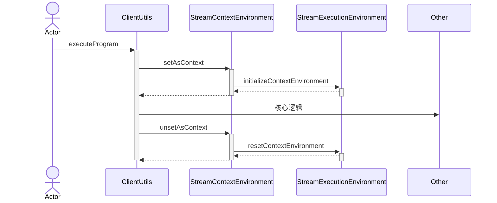

## 核心方法

### 1. 获取执行环境

```java
public static StreamExecutionEnvironment getExecutionEnvironment(Configuration configuration) {
    return Utils.resolveFactory(threadLocalContextEnvironmentFactory, contextEnvironmentFactory)
            .map(factory -> factory.createExecutionEnvironment(configuration))
            .orElseGet(() -> StreamExecutionEnvironment.createLocalEnvironment(configuration));
}
```

&ensp;&ensp;&ensp;&ensp;该方法使用了StreamExecutionEnvironment类中的两个静态私有字段：`contextEnvironmentFactory`和`threadLocalContextEnvironmentFactory`。而对这两个字段的赋值操作方法也在StreamExecutionEnvironment类中：

```java
// 这两个字段值的都是在打包的程序提交时赋值的，对于每个直接运行的用户代码不会做任何修改
private static StreamExecutionEnvironmentFactory contextEnvironmentFactory = null;
private static final ThreadLocal<StreamExecutionEnvironmentFactory>
            threadLocalContextEnvironmentFactory = new ThreadLocal<>();

protected static void initializeContextEnvironment(StreamExecutionEnvironmentFactory ctx) {
    contextEnvironmentFactory = ctx;
    threadLocalContextEnvironmentFactory.set(contextEnvironmentFactory);
}

protected static void resetContextEnvironment() {
    contextEnvironmentFactory = null;
    threadLocalContextEnvironmentFactory.remove();
}
```

由此可见在getExecutionEnvironment方法中，第一行代码是从ThreadLocal中获取创建上下文环境的工厂对象，第二行则是针对于打包程序，使用赋值好的StreamExecutionEnvironmentFactory创建执行环境，第三行则是针对直接运行的代码创建LocalStreamEnvironment本地执行环境。

> 下面我们简单介绍下如何调用代码块中两种方法的。


### 2. 提交任务

```java
public JobExecutionResult execute(String jobName) throws Exception {
    final List<Transformation<?>> originalTransformations = new ArrayList<>(transformations);
    StreamGraph streamGraph = getStreamGraph();
    if (jobName != null) {
        streamGraph.setJobName(jobName);
    }
  
    try {
        return execute(streamGraph);
    } catch (Throwable t) {
        Optional<ClusterDatasetCorruptedException> clusterDatasetCorruptedException =
                ExceptionUtils.findThrowable(t, ClusterDatasetCorruptedException.class);
        if (!clusterDatasetCorruptedException.isPresent()) {
          	throw t;
        }
      
        // Retry without cache if it is caused by corrupted cluster dataset.
        invalidateCacheTransformations(originalTransformations);
        streamGraph = getStreamGraph(originalTransformations);
        return execute(streamGraph);
    }
}
```


一个流式任务执行的Context，配置并行度和checkpoint容错相关的参数。

`protected final ExecutionConfig config = new ExecutionConfig();`

`protected final CheckpointConfig checkpointCfg = new CheckpointConfig();`

`protected final Configuration configuration;`

Configuration对象应该是新添加的ConfigOptions（与DataStreamAPI配置相关的主要类）中真正的来源。


保存DataStream转换操作：

`protected final List<Transformation<?>> transformation = new ArrayList<>();`

sequenceDiagram




```sequence
Alice->>Bob: Hi Bob
Bob->>John: no
John-->>Bob: hi
Bob->>Alice: Hi Alice
```

