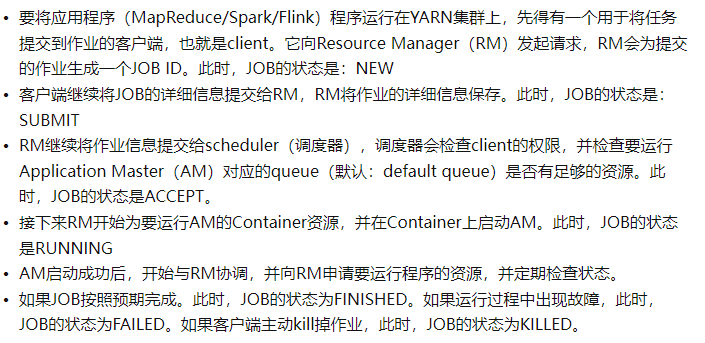

```scala
1、使用Operator Chain的优点：
    (1) 减少线程间的切换
    (2) 减少序列化和反序列化的操作
    (3) 降低了延迟和提高了吞吐量
```

~~~scala
分布式文件缓存：DistributedCache
	在TashManager进程中的slot所维护的线程，在并行执行的时候，可以共享包含外部数据的文件。
	（将HDFS上的资源文件下载到本地，即TaskManager进程所在的节点 -> TaskManager进程中的slot所管理的线程读取本地文件中的数据，并装载到内存 -> 进行计算）

注册文件缓存：
	env.registerCachedFile("hdfs://bigdata01:9000/filename", "name")
获取文件信息(在RichxxxxFunction中)：
	this.getRuntimeContext.getDistributedCache().getFile("name")
~~~


### day01
~~~
SparkStreaming用的是系统时间，Flink支持event事件时间，结合Watermark处理乱序数据

task slot的个数和core的个数是一一对应，若core支持超线程，则task slot = 2 * core

spark中，--executor-cores 2指定的只是Worker中能启动多少个Executor

spark中，Master管资源，Driver管任务，而Flink中JobManager = 资源调度 + 任务调度
~~~
~~~
二、
	使用yarn-session模式时：
		JobManager进程的名称由StandaloneSessionClusterEntrypoint改为YarnSessionClusterEntrypoint
		
	使用run a flink job on yarn模式时：
		JobManager进程的名称由StandaloneSessionClusterEntrypoint改为YarnJobClusterEntrypoint
		
	无论哪种模式：
		TaskManger进程的名称由TaskManagerRunner改为YarnTaskExecutorRunner

四、
	yarn contianer底层调用的是lxc(linux container)


七、
	提交yarn-session的时候，会在提交的机器上生成/tmp/.yarn-properties-root文件，标识yarn-session；当同一台机器提交多个yarn-session时，该文件会被新的覆盖。


八、
	提交Job的时候，是否要指定yarn-session的id：
		1、在提交yarn-session的机器上，提交job时，如果该机器上提交过多个yarn-session，则需要指定yid，若不指定，则会按照最近一次提交的yarn-session的applicationId来提交（读取最新的/tmp/.yarn-properties-root文件）；如果总共只提交过一次yarn-session，则不需要指定yid，因为/tmp/.yarn-properties-root文件中的内容不变。
		
		2、在Hadoop集群中（除提交yarn-session）的任意一台机器上，提交job时，不指定yid，就会去$FLINK_HOME/conf/flink-conf.yaml中去找${jobmanager.rpc.address}:${rest.port}这个地址，或者使用。若配置的地址刚好与yarn上生成的jobmanager的地址（主机+端口）相同，则不需要指定yid；反之就需要指定yid，不指定yid，任务就会提交失败。（推荐在其他机器上，指定yid）
	
	
九、
	run a flink job on yarn后台启动：flink run -m yarn-cluster -yn 5 -ys 3 -ynm cluster -c <全限定类名> -p <并行度> -d <jar>
	不会生成/tmp/.yarn-properties-root文件


十、
	flink取消job：
		1、通过webUI取消(是调用source的cancel方法)		
		2、通过flink list拿到job的id，然后通过flink cancel jobid取消(这种方式只适用于yarn-session模式)
		3、通过kill -9 taskmanager进程id

十一、
	yarn-session和run a flink job on yarn在前端执行的时候，其jobmanager + taskmanager进程均为YarnSessionClusterEntrypoint + YarnTaskExecutorRunner；
	对应的客户端进程分别为（FlinkYarnSessionCli和CliFrontend）；
	在后端执行时，其jobmanager进程分别为(YarnSessionClusterEntrypoint、YarnJobClusterEntrypoint),taskmanager进程均为YarnTaskExecutorRunner；


十二、
	①以会话窗口执行时：
		使用kill -9 会话窗口进程id：
			无论哪种模式，其jobmanager都是yarn-session的模式的后台启动，干掉其taskmanager进程（即取消job）都不会使jobmanager停止。
		使用ctrl + c关闭会话窗口：
			yarn-session模式时，会删除/tmp/.yarn-properties-root文件（其他关闭方式不会删除该文件），并且该yarn-session的application的state为FINISHED，FinalStatus为SUCCEEDED。
			run a flink job on yarn模式时，该模式将转换为yarn-session模式，干掉其taskmanager进程（即取消job）都不会使jobmanager停止。

	②以后台执行时：
		yarn-session模式时，干掉其taskmanager进程（即取消job）都不会使jobmanager停止。
		run a flink job on yarn模式时，取消job的方式，停掉集群,都会使jobmanager停止:
			通过WebUI取消：applicattion的state为FINISHED，FinalStatus为KILLED。
			通过flink cancel jobid取消：applicattion的state为FINISHED，FinalStatus为KILLED。
			通过kill -9 taskmanager进程id：application的state为FINISHED，FinalStatus为FAILED，说明任务失败。

	③无论哪种模式，在linux上使用Kill -9 jobmanager进程id，application的state为FAILED，FinalStatus为FAILED。
	
	④无论哪种模式，在linux上使用yarn application -kill <applicationID>，application的state为KILLED，FinalStatus为KILLED，如果是前端启动，则前端会话窗口不会退出


十三、
	yarn-session和run a flink job on yarn所需要的资源，在启动的时候，yarn根据给定的参数，就已经分配好了，如果资源不够了，可以savePoint后，再重新提交job。
	

十四、
	flink on yarn的HA是重启模式，并不是同时存在主备，而是当主挂掉后，重新生成一个备份顶上去，成为主。而SparkHA和HadoopHA是主备模式，同时存在standby和active状态的节点，此时就需要zk来做选举。
	
	
十五、
	flink on yarn的HA模式下，使用kill -9 jobmanager进程id时，会重新生成一个新的jobmanager，次数由yarn.application-attempts来决定?
	

十六、
	yarn-site.xml配置文件中设置的yarn.resourcemanager.am.max-attempts次数，表示全局提交应用程序最大尝试次数；
	flink-conf.xml中配置的yarn.application-attempts次数，表示当前Job提交的最大尝试次数。
	yarn.application-attempts <= yarn.resourcemanager.am.max-attempts
	当局部大于全局，则局部会被全局覆盖.
	

十七、
	在Yarn管理界面中，点击启动的flink Application，会显示flink的控制面板，是因为该界面代码，存在于jar包中，不是跳转界面。
~~~




~~~
Job的状态如上图
~~~


### day03

~~~
一、
	从Spark中的pipeline角度看，pipeline对应的就是operator chain，将operator chain并以递归函数展开式的方式，组装到一个thread中。一个Task就对应一个Stage，Task中子任务subTask对应的就是Thread
	

二、
	没优化前，每一个operator单并行度都会产生一个thread，当前者将数据发给后者时，会涉及到网络IO，即会有序列化和反序列化的过程，故使用operator chain进行优化，从而减少该过程。
	

三、
	keyBy算子上不能设置并行度，是一个分流算子（主流内部分流），不是一个处理算子，最终的并行度通过keyBy之后的处理算子指定，没有对应的Task，须与后面的处理算子形成一个Task。
	

四、
	disableChaining()和startNewChain区别：
		disableChaining()是使该算子关闭算子链，不存在operator chain中
		startNewChain()是从该算子起，重新组成一个新链，若前面有算子，将不会和该算子组成operator chain
		eg: 拿WordCount说：在flatMap()上，使用disableChaining()是不让flatMap()算子存在于source + flatMap + Map的operator chain中，而是让其独立开来，所以将一个Task转换成3个Task；使用startNewChain()是从flatMap()算子开始新建一条operator chain，使source和flatMap之间断开，让flatMap和Map组成新的Task.
		
		
五、
	如果某个算子的业务逻辑非常复杂，可以使用disableChaining()将其独立出来，并使用setParallelism(n)来独立设置并行度.然后可以调度到别的solt中，默认solt名称为default，可以指定某个算子的solt名称比如test（.slotSharingGroup("test")），从而分配该算子到名为test的slot中（该算子有几个并行，就有几个名为test的slot），需要注意的是，后面的算子也会一起进入这个slot中，再通过.slotSharingGroup("default")，将其重新调度到之前默认的default的slot中。
	

六、
	由于一个core可以开启多个线程，故一个task slot中可以开启多个thread
	

七、
	不同Task的subtask需要分发到同一个task slot中，降低数据传输，提高执行效率
	相同Task的subtask需要分发到不同的task slot中，充分利用集群资源
	
	当Source可以并行的时候，依据数据位置，分发Source存在的Task的subtask，到离数据最近的TaskManager上的task slot上（参照HDFS副本存放机制或机架感知），当机器资源不足时，也会尽可能靠近数据位置，分发subtask
	
	共享slot？
	

八、
	operator的并行度 <= 总task slot的数量，否则任务会失败
	每个TaskManager上task slot数量 = core数量最好
	当有N个Task时，每个task slot的线程数 <= N
	

九、
	readTextFile()底层使用readFile()，FileProcessingMode为ONCE
~~~


### day04

~~~java
一、
	Spark未被Flink替代，是因为Structured Streaming中的WaterMark，Flink中的WaterMark更灵活。

二、
	自定义数据源可以读取任何地方的数据，然后通过SourceContext上下文对象collect()出去。可以替换掉FlinkKafkaConsumer，自定义从kafka中读数据（kafka-client包）。把offset写在flink的状态中，写在__consumer_offset中不够精准
    从flink1.14版本之后，使用KafkaSource替换掉FlinkKakfaConsumer：env.fromSource([KafkaSource.class])
	
三、
	所有并行度的设置，都是Transformation这个类下的方法setParallelism()方法。
	
四、
	FlinkKafakConsumer构造方法的第2个参数：
		new KafkaDeserializationSchema()：读取Kafka中key、value
		new SimpleStringSchema(): 读取Kafka中value
   	在Flink1.14版本之后，将会被废弃，采用kafkaSource代替。
		
五、
	flatMap实现filter功能，只需要在flatMap中定一个集合，满足条件的放入，最后返回即可。在Flink中，flatMap还可以接收两个参数，第二个值为Collector，可以使用collect方法将元素写出
	StreamExecutionEnvironment env = StreamExecutionEnvironment.getExecutionEnvironment();
    DataStreamSource<Integer> source = env.fromElements(1, 2, 3);
    source
           .flatMap(new FlatMapFunction<Integer, Integer>() {
               @Override
               public void flatMap(Integer value, Collector<Integer> out) throws Exception {
                    if (value != 3) out.collect(value);
               }
            })
            .print();

    env.execute("test");
~~~


### day05

~~~
一、
	flink中的keyBy + reduce算子和spark中的reduceBy方法不同，因为flink中的数据是一条一条的处理的，所以必须先指定key，让该数据进入相应的key的分组中，然后再聚合，但是对spark来说，数据以批过来的，可以等数据到了，然后再根据key分组聚合。
	
二、
	相同key的数据一定是由某一个subtask处理，一个substask可能会处理多个key所对应的数据
	
三、
	iterate，scala中返回一个二元组(DataStream, DataStream),第一个DataStream中的数据会继续返回到stream流中，第二个会往下游发送，可以传入一个ConnectedStream
	
四、
	ProcessFunction，属于底层API，越低层次，功能越强大，可以拿到元数据状态信息、事件时间、设置定时器。根据传入的Stream类型，决定使用哪种ProcessFunction。
	
五、
	shuffle:增大分区、提高并行度、解决数据倾斜。分区元素随机均匀分发到下游，网络开销比较大。
	rebalance:增大分区、提高并行度、解决数据倾斜。轮询分区元素，均匀的将元素分发到下游分区，下游每个分区的数据比较均匀，在发生数据倾斜时非常有用，网络开销比较大。
    rescale:减少分区，防止发生大量的网络传输，通过轮询分区元素，将一个元素集合从上游分区发送给下游分区，发生的是本地数据传输，而不需要通过网络传输数据，上游的数据值会发送给本taskmanager中的下游。
    broadcast：需要使用映射表、并且映射表会经常发生变动的场景。上游中的每一个元素内容广播到下游每一个分区中。
    global:并行度将为1。上游分区的数据只分发给下游的第一个分区。
    forward：一对一的数据分发。上游数据分发到下游对应分区中。
    keyBy：根据上游分区元素的Hash值与下游分区数取模，决定当前元素分发到哪个分区。
    PartitionCustom：自定义分区器，决定元素如何从上游发送到下游。通过继承Partitioner类
    
    以上除keyBy算子，其余均返回DataStream
~~~


### daoy06

~~~
clean方法是为了清除闭包，防止引用未被serializable的对象。

map、filter、flatMap底层调用transform方法，返回的都是SingleOutputStreamOperator对象

通过.name()设置算子名字，实质上是设置Transformation对象的名字。

transient表示不序列化的

keyBy中是指定hashcode值相同的数据发向同一分区，一个分区中可以有多个组。key值相同的形成一个组。POJO分区得重写hashcode方法.之后通过聚合算子分组。

keyBy上游中每一个subtask都有对应下游分区数量的channel-->一个缓冲区，下游从该缓冲区拿数据。

source底层需要传入StreamSource
transform中需要传入StreamMap、StreamFilter、StreamFlatMap
sink底层需要传入StreamSink
都是继承了：
	AbstractUdfStreamOperator<OUT, F extends Function> extends AbstractStreamOperator<OUT>


RecordWriter有两个：ChannelSelectorRecordWriter
				   BroadcastRecordWriter
	
调用processElement方法，通过Ouput接口中的collect方法发射出去，最终调用RecordWriter其中的emit方法，写出数据。

flink可以帮我们把Bean序列化

涉及分区改变时，都有个缓冲区。
~~~


### day07

~~~
时间种类：
	event time： 事件创建时间
	ingestion time： 数据进入flink的时间（进入source）,但是没有这个类型的窗口
	processing time： 系统时间（默认），就是被window operator执行的时间
	
window将一个无限的stream拆分成有限大小的“buckets”桶。例如当写数据到HBase中，可以先攒一批，然后再写入，不必一条一条写。

window是处理无限流的核心。

窗口种类：分两种，一种为globalwindow，其实现只有一种，为countwindow，按照条数划分窗口
			一种为timewindow，其实现有三种，（滚动窗口->TumblingWindow、滑动窗口->SlidingWindow、会话窗口->SessionWindow）
				滚动窗口：窗口长度固定，不会有重叠
				滑动窗口：窗口长度固定，有重叠（当滑动参数 < 窗口大小）
				会话窗口：通过时间间隔来划分，超出给定间隔，将进入新的窗口中
				
keyedWindow中session window和global window是针对于每个分区的每个分组，达到条件才执行windowFunction。				

按照是否分区（是否使用keyBy），又分为KeyedWindow和NonKeyedWindow，NonKeyedWindow及操作NonKeyedWindow的算子的并行度只能为1

WaterMark是，让时间类型窗口触发的一种机制

WaterMark是每个subtask中最大的EventTime - 延迟时间，窗口触发时机：watermark >= 窗口的结束边界（老版API，新版相当于>，实际上还是>=,因为新版本计算方式为：最大的EventTime - 延迟时间 - 1）。比如5s的滚动窗口，4999会触发（4999 - 0 = 4999），而新版要5000才触发（5000 - 0 - 1 = 4999） 

WaterMark只会涨，不会降下来

窗口是通过计算出来的，不是连续变化的。

BoundedOutOfOrdernessTimestampExtractor是支持乱序的时间提取器。

windowFunction中reduce是增量聚合。触发窗口后，返回结果就行了。也可以做全量聚合，调用apply方法。apply方法是window的底层方法。

apply方法，是将同一个窗口内的数据攒起来（window state），窗口触发后再进行计算。

compare方法，返回值大于0就不用交换位置

windowFunction中就知道增量聚合reduce和全量聚合apply。

在keyedStream中，只有窗口函数上游的每个subtask的watermark达到窗口的触发条件，才会触发窗口。比如一个窗口，接收上游2个watermark，那么该window会等到上游两个watermark都超过窗口边界，才会触发。
~~~


### day08

~~~
State状态默认保存在JobManager的内存中，也可以保存到别的地方，如HDFS。State状态可以是多种类型的。

StateBackend：状态后端，是保存状态的地方

checkpointing会周期性的一直做。可以设置时间。

JM中的定时器trigger checkpoint，然后JM中的协作者CheckpointCoordinator通过RPC给TM中的subtask发送checkpoint消息，然后持有状态的subtask会将状态存储到状态后端中（老版本是每个subtask对应一个小文件，新版本是在一个文件夹（名称是jobid）下面生成多个文件夹，其中有个chk-0的文件夹，此文件夹会被新的chk覆盖变成chk-1等，将多个subtask的state写入一个文件中），然后每个subtask向JM返回ack消息。

如果JM收到的ack没有满足数量，那么是某个subtask出现异常，此时会将所有的subtask都free掉，然后JM重新分发subtask，每个subtask先从状态后端读取最近的一次状态(open方法)，再进行计算。
~~~


### day09

~~~
生产环境几分钟做一次checkpoint

先open方法，最后close方法，其他的夹在中间。

valueState底层也是使用的一个Map类型-->StateTable类中有个StateMap。

Internal ->内部的

Interval ->周期的

State分两类：Keyedtate和OperatorState
			1.KeyedState是调用了keyBy方法，针对keyedStream，每个subtask中相互独立的state，不需要我们管理key值，底层是Map
				（1）ValueState，保存value
				（2）MapState，保存的value是一个kv类型
				（3）ListState，保存的value是一个List结构
			2.OperatorState是没有调用keyBy方法，分两种
				（1）每一个subtask自己一个ListState状态，可以保存多个值，底层是List
				（2）Broadcast state，通常作为字典数据，维度数据关联,通常使用connect算子操作。
				
在内存中保存的状态，就是HeapValueState、HeapMapState、HeapListState
~~~


### day10

~~~
state的ttl(存活时间):只有KeyedState可以设置TTL,要跟StateDescriptor关联到一起

每个key的状态都有自己的存活时间（StateTable中的每个key值）。

清理过期的状态，.disableCleanupInBackground()禁用掉后台的清理线程，在下次该状态被调用的时候，进行清理--默认情况下
			.cleanupFullSnapshot()在做快照的时候，即subtask保存状态的时候，清理过期状态
			
keyedState使用open方法获取之前状态。operatorState，必须实现一个接口CheckpointedFunction,其中有snapshotState和initializeState，initializeState方法比open方法先执行。

一般状态前面都用transient修饰，让该状态只能在TM中被反序列化出来时，在open方法或者initializeState方法中，通过状态恢复给它赋值。

恢复策略，是指task的恢复策略，一个job中不同的流之间如果没有关系，其中一条流出现异常，只有出现异常的那条流会重新分发subtask，其他的流不会。

为了更快关联，可以把维度数据广播出去，然后用事实关联(connect)维度，connect之后可以共享状态。先处理广播的数据，再处理事实的数据。

flink对接kafka，可以把偏移量记录到flink的状态中
~~~

### day11

~~~
ProcessFunction和MapFunction都可以对每条数据进行操作，但是MapFunction仅限于数据层面的操作，而ProcessFunction可以将数据与环境结合起来，比如可以做测流输出

主流里面包含打标签和没打标签的，主流中的数据需要通过Collect输出，而测流中的数据需要通过ctx.output输出。

两条流join可以划分窗口，让他们存活一段时间，或者使用connect，让两条流共享状态，并将数据暂存状态中，给状态设置ttl。

异步IO，就是用来访问外部数据的，用来关联外部维度数据的，更加高效。
~~~
