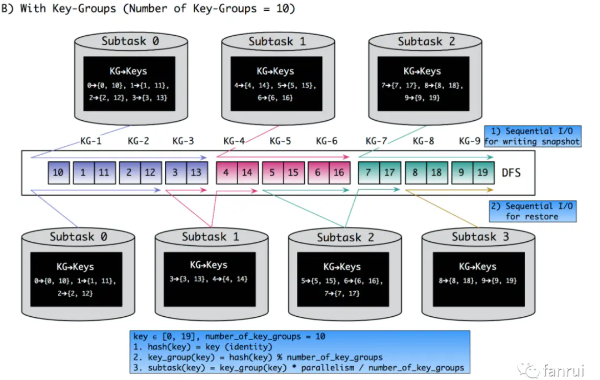

## 一、总体概览

|      算子       |                             原理                             |            实现             |
| :-------------: | :----------------------------------------------------------: | :-------------------------: |
|     global      |              上游的数据只分发给下游的第一个分区              |     *GlobalPartitioner*     |
|    broadcast    |       （只讨论广播数据）上游的数据广播给下游的每个分区       |   *BroadcastPartitioner*    |
|     forward     |             上下游并发度必须一样，数据一对一发送             |    *ForwardPartitioner*     |
|     shuffle     |                   随机均匀分配，网络开销大                   |    *ShufflePartitioner*     |
|    rebalance    |                     轮询发送，网络开销大                     |   *RebalancePartitioner*    |
|     rescale     |             TaskManager本地轮询发送，网络开销小              |    *RescalePartitioner*     |
|      keyBy      | hash发送，每个key发送到对应的分区key -> key group -> subtask | *KeyGroupStreamPartitioner* |
| partitionCustom |         自定义分区逻辑，每个key发送到对应的KeyGroup          | *CustomPartitionerWrapper*  |

1. 对应的类都是以Partitioner结尾（除了partitionCustom），但不是实现Partitioner接口，而是继承了StreamPartitioner抽象类，最顶层是实现了ChannelSelector接口。

   ```java
   public interface ChannelSelector<T extends IOReadableWritable> {
       void setup(int numberOfChannels);
       // 最核心的实现方法
       int selectChannel(T record);
     
       boolean isBroadcast();
   }
   ```

2. 每个算子对应的selectChannel方法

   1. global：`return 0;`

   2. broadcast：`throw new UnsupportedOperationException(...);`

   3. forward：`return 0;`

   4. shuffle：`return random.nextInt(numberOfChannels);`

   5. rebalance：

      ```java
      private int nextChannelToSendTo;
      
      @Override
      public void setup(int numberOfChannels) {
          super.setup(numberOfChannels);
          nextChannelToSendTo = ThreadLocalRandom.current().nextInt(nextChannelToSendTo);
      }
      
      @Override
      public int selectChannel(SerializationDelegate<StreamRecord<T>> record) {
          nextChannelToSendTo = (nextChannelToSendTo + 1) % numberOfChannels;
          return nextChannelToSendTo;
      }
      ```

   6. rescale：

      ```java
      private int nextChannelToSendTo = -1;
      
      @Override
      public int selectChannel(SerializationDelegate<StreamRecord<T>> record) {
          if (++nextChannelToSendTo >= numberOfChannels) {
              nextChannelToSendTo = 0;
          }
          return nextChannelToSendTo;
      }
      ```

   7. partitionCustom：

      ```java
      @Override
      public int selectChannel(SerializationDelegate<StreamRecord<T>> record) {
          K key;
          try {
              key = keySelector.getKey(record.getInstance().getValue());
          } catch (Exception e) {
              throw new RuntimeException("Could not extract key from " + record.getInstance(), e);
          }
          return partitioner.partition(key, numberOfChannels);
      }
      ```

      

## 二、keyBy算子（DataStream -> KeyedStream）

1. 生成一个

2. 其中的核心KeyGroupStreamPartitioner、KeyGroup、KeyGroupRangeAssignment。

   

   1. KeyGroupStreamPartitioner中的selectChannel方法，选择将该key发送到下游的某个subtask中

      ```java
      @Override
      public int selectChannel(SerializationDelegate<StreamRecord<T>> record) {
          K key;
          try {
              key = keySelector.getKey(record.getInstance().getValue());
          } catch (Exception e) {
              throw new RuntimeException(
                      "Could not extract key from " + record.getInstance().getValue(), e);
          }
          return KeyGroupRangeAssignment.assignKeyToParallelOperator(
                  key, maxParallelism, numberOfChannels);
      }
      ```

   2. KeyGroupRangeAssignment如下

      ```java
      // 其中maxParallelism = keyGroup数量
      public final class KeyGroupRangeAssignment {
          // 默认最小的maxParallelism为128
          public static final int DEFAULT_LOWER_BOUND_MAX_PARALLELISM = 1 << 7;
        
          // 默认最大的maxParallelism为32768 -> 1 << 15
          public static final int UPPER_BOUND_MAX_PARALLELISM = 
                  Transformation.UPPER_BOUND_MAX_PARALLELISM;
          
          private KeyGroupRangeAssignment() {
              throw new AssertionError();
          }
          
          // parallelism为当前算子的并行度
          public static int assignKeyToParallelOperator(Object key, int maxParallelism, int parallelism) {
              Preconditions.checkNotNull(key, "Assign key must not be null!");
              return computeOperatorIndexForKeyGroup(
                      maxParallelism, parallelism, assignToKeyGroup(key, maxParallelism));
          }
          
          // 计算key对应的keyGroupId
          public static int assignToKeyGroup(Object key, int maxParallelism) {
              Preconditions.checkNotNull(key, "Assign key must not be null!");
              return computeKeyGroupForKeyHash(key.hashCode(), maxParallelism);
          }
          
          // 通过murmurHash算法计算，下标从0开始
          public static int computeKeyGroupForKeyHash(int keyHash, int maxParallelism) {
              return MathUtils.murmurHash(keyHash) % maxParallelism;
          }
      
          // 计算该keyGroup所对应的subtask index
          public static int computeOperatorIndexForKeyGroup(
                  int maxParallelism, int parallelism, int keyGroupId) {
              return keyGroupId * parallelism / maxParallelism;
          }
        
          // 当用户没有显示的指定maxParallelism时，通过算子的并行度来计算默认的最大并行度
          public static int computeDefaultMaxParallelism(int operatorParallelism) {
              checkParallelismPreconditions(operatorParallelism);
              return Math.min(
                      Math.max(
                              // 将计算出来的数转成2的次方数
                              MathUtils.roundUpToPowerOfTwo(
                                      operatorParallelism + (operatorParallelism / 2)),
                              DEFAULT_LOWER_BOUND_MAX_PARALLELISM),
                      UPPER_BOUND_MAX_PARALLELISM);
          }
        
          // 并行度必须大于0且小于等于1 << 15
          public static void checkParallelismPreconditions(int parallelism) {
              Preconditions.checkArgument(
                        parallelism > 0 && parallelism <= UPPER_BOUND_MAX_PARALLELISM,
                        "Operator parallelism not within bounds: " + parallelism);
          }
        
          // 计算某subtask对应的keyGroup范围
          public static KeyGroupRange computeKeyGroupRangeForOperatorIndex(
                  int maxParallelism, int parallelism, int operatorIndex) {
              checkParallelismPreconditions(parallelism);
              checkParallelismPreconditions(maxParallelism);
            
              Preconditions.checkArgument(
                       maxParallelism >= parallelism,
                       "Maximum parallelism must not be smaller than parallelism.");
              int start = ((operatorIndex * maxParallelism + parallelism - 1) / parallelism);
              int end = ((operatorIndex + 1) * maxParallelism - 1) / parallelism;
              return new KeyGroupRange(start, end);
          }
      }
      ```

   3. KeyGroupRange中保存着该keyGroup的起始索引和结束索引

      ```java
      public class KeyGroupRange implements KeyGroupsList, Serializable {
          private final int startKeyGroup;
          private final int endKeyGroup;
          ...
      }
      ```

   4. 


## 三、broadcast算子（DataStream -> DataStream/BroadcastStream）

1. 两种场景：
   1. 广播数据
   2. 广播状态，需要先了解MapState，详见下一章节