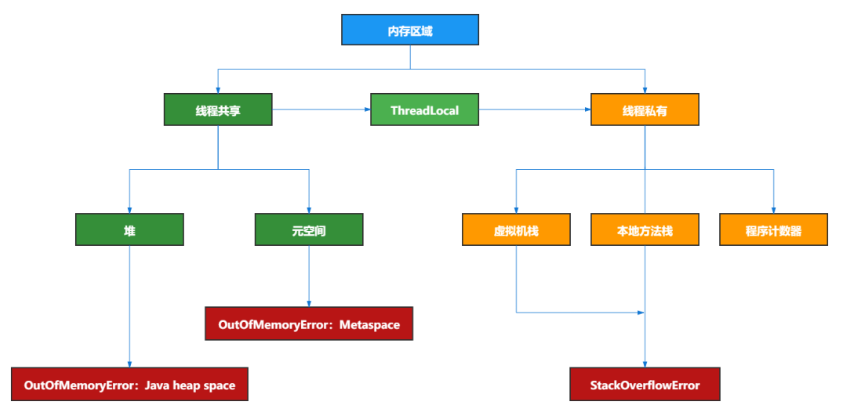
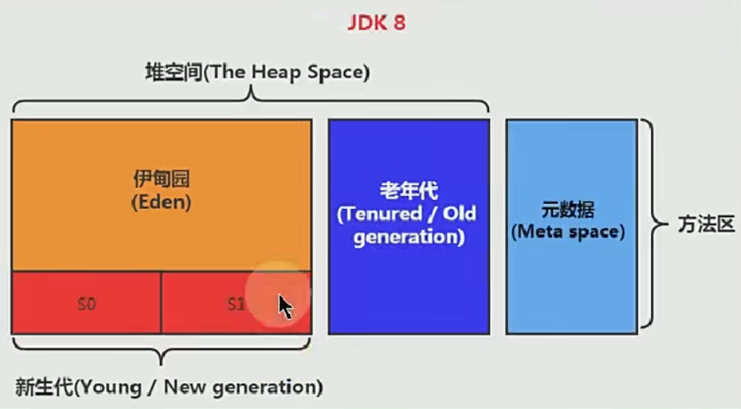
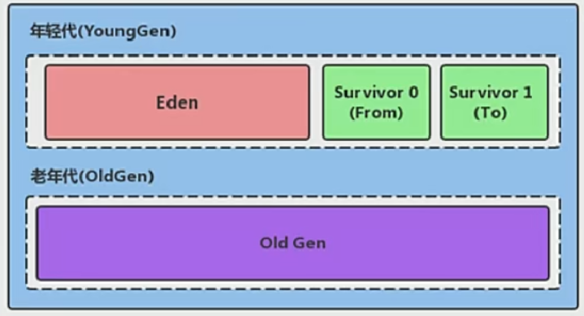
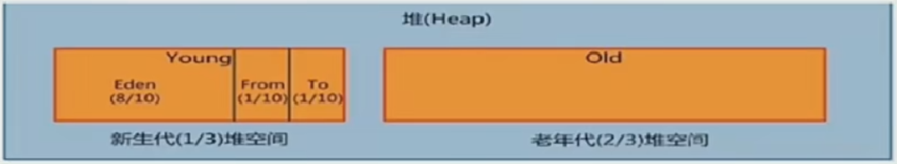
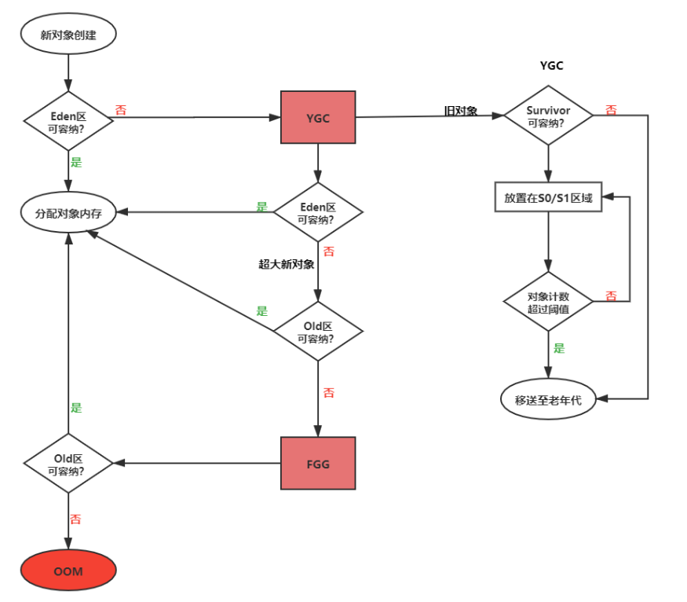
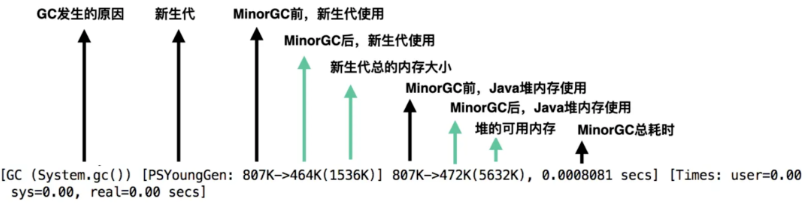
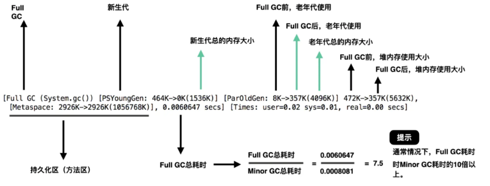

## HotSpot内存结构

### 一、线程共享

#### 1. **方法区（Method Area）**

1. 存储已被虚拟机加载的`类型信息(类名、访问修饰符等)`、`常量`、`静态变量`、即时编译器编译后的`代码缓存`等数据。
2. 方法区逻辑上是堆空间的一部分，为了和堆区分开来，方法区也叫做“非堆”non-heap，会产生OOM（java.lang.OutOfMemoryError: PermGen space）。
3. JDK7及之前的HotSpot版本中，方法区实现为永久代`PermGen`，JDK8中的方法区实现为元空间`Metaspace`：
   1. 永久代仅仅是HotSpot虚拟机的设计团队选择把收集器的分代设计拓展至方法区，使用永久代来实现方法区而已，这样使得HotSpot的垃圾收集器能够像管理Java堆一样管理这部分内存。
   2. 永久代在启动时就确定了大小`-XX:PermSize`和`-XX:MaxPermSize` ， 其设计导致了Java应用更容易遇到内存溢出的问题，难以进行调优。
   3. JDK7的HotSpot已经把原本放在永久代的运行时常量池、静态变量移出了，到了JDK8，完全废弃了永久代的概念，改用其他虚拟机实现中的元空间（Metaspace）来代替，把JDK7中永久代还剩余的内容（主要是类型信息）全部移到元空间中。
   4. 元空间并不在JVM中，而是使用`本地内存`，使用`-XX:MetaspaceSize `来指定元空间的初始化大小，达到该值时进行GC，同时GC会对该值进行调整，不超过`-XX:MaxMetaspaceSize`，其默认值为**∞**。

#### 2. **堆（Heap）**

1. 概述

   1. 堆中区域的划分仅仅是一部分垃圾收集器的 共同特性或者说是设计风格而已而非某个Java虚拟机具体实现的固有内存布局。将java堆细分的目的只是更好地回收内存，或者更快地分配内存
   2. 存储的是我们new出来的对象，不存放基本类型和对象引用
   3. 从分配内存的角度看，所有线程共享的Java堆中可以划分出多个线程私有的分配缓冲区（ThreadLocal Allocation Buffer，TLAB），以提升对象分配时的效率
   4. Java堆可以处于物理上不连续的内存空间中，但在逻辑上它应该被视为连续的

2. 内部结构

   

   

   1. 新生代和老年代

      1. 堆区进一步细分为YoungGen和OldGen
      2. 存储在JVM中的Java对象分为两类：
         1. 生命周期短的瞬时对象，这类对象的创建和消亡都非常迅速；这种对象放在YoungGen中
         2. 生命周期非常长，这种对象放在OldGen中

      

      3. 其中YoungGen又可分为Eden区、Suvivor0（from）和Suvivor1（to）
      4. 绝大部分Java对象的销毁都是在YoungGen进行

3. ***内存分配原则***

   1. 对象优先在Eden分配
      1. 大多数情况下，对象在新生代Eden区中分配，当Eden没有足够空间进行分配时，JVM将进行一次Minor GC。
      2. 进行Minor GC的时候，如果发现Eden区中的对象无法全部放入Survivor空间，则通过分配担保机制提前转移到老年代去。
   2. 大对象直接进入老年代
      1. 大对象在分配空间时，容易导致提前触发垃圾回收，且当复制大对象时，意味着高额的内存复制开销，故应该尽量避免程序中出现过多的大对象。
      2. `-XX:PretenureSizeThreshold`：指定大于该设置值的对象直接在老年代分配，这样做的目的是避免在Eden及两个survivor区之间来回复制，产生大量的内存复制操作。
   3. 长期存活的对象分配到老年代
      1. HotSpot多数收集器都采用了分代收集来管理堆内存，JVM给每个对象在对象头中定义了一个`对象年龄计数器`。
      2. 对象通常在Eden区诞生，如果经过第一次Minor GC后仍存活，并且能被Survivor容纳，该对象会被移动到Survivor空间中，并且将其对象年龄设为1岁。
      3. 对象在Survivor区每熬过一次Minor GC，年龄就增加1岁，当年龄增加到`-XX:MaxTenuringThreshold`时，就会被晋升到老年代中，默认为15。
   4. 动态对象年龄判定
      1. HotSpot并不是永远要求对象的年龄必须达到`-XX:MaxTenuringThreshold`才能晋升老年代，如果Survivor空间中相同年龄的所有对象大小总和大于Survivor空间的一半，年龄大于或等于该年龄的对象就可以直接进入老年代，无须等到`-XX:MaxTenuringThreshold`中要求的年龄。
      2. to满了，也全部进入老年代。
   5. 空间分配担保（JDK6 Update 2之后）
      1. 在发生Minor GC之前，JVM必须先检查老年代最大可用的连续空间是否大于新生代所有对象总空间：
         1. 如果成立，那么这一次Minor GC可以确保是安全的。
         2. 如果不成立，则JVM会查看`-XX:+/-HandlePromotionFailure`的值是否允许担保失败：
            1. 如果允许，那么会继续检查老年代最大可用连续空间是否大于历次晋升到老年代的对象的平均大小：
               1. 如果大于，将尝试进行一次Minor GC，尽管这次Minor GC是有风险的。
               2. 如果小于，则改为一次Full GC。
            2. 如果不允许，则进行一次Full GC。
      2. JDK6 Update 24之后的规则变为：去除掉`-XX:HandlePromotionFailure`的影响，只要老年代的连续空间大于新生代对象总大小或历次晋升的平均大小，就会进行Minor GC，否则将进行Full GC。

4. 堆内存参数设置（一般堆内存设置为2GB）

   1. 堆的大小在JVM启动时就已经设定好了（假设机器物理内存大于1G）：

      1. `-Xms128M => -XX:InitialHeapSize=128M`：表示堆起始内存，默认值`物理内存 *  (1 / 64)`。
      2. `-Xmx512M => -XX:MaxHeapSize=512M)`：表示堆最大内存，超过该值就会OOM，默认值为`物理内存 * (1 / 4)`。
      3. 通常会将-Xms和-Xmx配置相同的值，因为JVM运行时，由于请求的流量的不确定性，可能会导致堆内存空间不断调整，增加服务器压力，为了能够在GC完后，堆不需要重新分隔计算堆的大小，避免调整堆大小时带来的压力，进而提高性能。

   2. 设置YoungGen和OldGen的比例

      

      1. `-XX:NewRatio=2`，表示新生代占1，老年代占2。
      2. 可以使用选项`-Xmn`设置新生代最大内存大小（一般使用默认值就可以了）。
      3. 上面两个参数不能同时使用。

   3. 设置YoungGen中Eden和Survivor的比例

      1. `-XX:SurvivorRatio=8`，这是缺省值，表示Eden占8，Survivor0和Survivor1比例为1:1，共占2
      2. 只有Eden和from为YoungGen可用的内存。

### 2. 线程私有

## 二、GC

1. 现代垃圾收集器大部分都是基于分代收集理论设计的

2. Minor/Young GC、Major/Old GC和Full GC

   

   1. JVM进行GC时，大部分时候回收的都是指新生代。
   2. GC按照回收区域分为两种：
      1. 部分收集（Partial GC）：
         1. YoungGen收集（Minor GC）
         2. OldGen收集（Major GC）
            1. 目前只有CMS会有单独收集老年代的行为
            2. 很多时候Major GC会和Full GC混淆使用，需要具体分辨是老年代回收还是整堆回收
         3. 混合收集（Mixed GC）
            1. 目标是收集整个新生代和部分老年代
            2. 目前只有G1会有这种行为
      2. 整堆收集（Full GC）：整个Java堆和方法区的垃圾回收。
   3. Young GC触发机制
      1. 当Eden区满了后会触发YGC，Survivor满不会触发GC
      2. YGC非常频繁，一般回收速度也比较快
      3. YGC会引发STW，暂停其他用户的线程，等待垃圾回收结束，用户线程才恢复运行
   4. Old GC触发机制
      1. 出现了Old GC，经常会伴随至少一次的YGC（但非绝对）
      2. 在OldGen空间不足时，会先尝试触发YGC，如果之后空间还不足，则触发Old GC，并不是说YGC触发后再触发Old GC。所以老年代GC也等同于Old GC或Full GC。
      3. Old GC的速度一般会比YGC慢10倍以上，STW的时间更长
      4. 如果Old GC后，内存还不足，就OOM。
   5. Full GC触发机制
      1. 调用System.gc()或Runtime.getRuntime().gc()时，是系统建议执行Full GC，不是立刻执行
      2. OldGen空间不足或者方法区空间不足
      3. 通过Old GC后进入老年代的平均大小大于老年代的可用内存
      4. 由Eden区、from向to区复制时，对象的大小大于to的可用内存，则把该对象转存到老年代，且老年代的可用内存小于该对象大小

3. GC日志

   1. 参数配置

      1. `-XX:+PrintGC`或`-verbose:gc`：开启GC日志
      2. `-XX:+PrintGCDetails`：创建更详细的GC日志
      3. `-XX:+PrintGCTimeStamps`或`-XX:+PrintGCDateStamps`：用于分析GC之间的时间间隔
      4. `-Xloggc:filename`：指定将GC日志输出到具体文件，默认为标准输出
      5. `-XX:NumberOfGCLogfiles`及`-XX:UseGCLogfileRotation`：控制日志文件循环，默认为0
      6. `-XX:+PrintTenuringDistribution`：显示年龄

   2. YGC日志：

      

   3. Full GC日志：

      

4. 垃圾回收算法

   1. 垃圾判别阶段算法：
      1. 引用计数算法：
         1. 原理：每个对象保存一个整型的引用计数器属性，用于记录对象被引用的情况
         2. 优点：实现简单，垃圾对象便于辨识，判定效率高，回收没有延迟性
         3. 缺点：无法处理循环引用的情况，所以在Java垃圾回收器中没有使用这类算法
      2. 可达性分析算法：
         1. 原理：以GC Roots为起始点，按照从上至下的方式搜索被根对象集合所连接的目标对象是否可达
         2. 优点：实现简单，执行高效，有效的解决循环引用的问题，防止内存泄漏
         3. GC Roots有哪些？
            1. 在虚拟机栈（栈帧中的本地变量表）中引用的对象，譬如各个线程被调用的方法堆栈中使用到的参数、局部变量、临时变量等。
            2. 在方法区中类静态属性引用的对象，譬如Java类的引用类型 静态变量。
            3. 在方法区中常量引用的对象，譬如字符串常量池（String Table）里的引用。
            4. 在本地方法栈中JNI（即Native方法）引用的对象。
            5. JVM内部的引用，如基本数据类型对应的Class对象，一些常驻的异常对象，还有系统类加载器。
            6. 所有被同步锁（synchronized关键字）持有的对象。
   2. 垃圾清除阶段算法：

5. 垃圾回收器

## 三、JVM调优