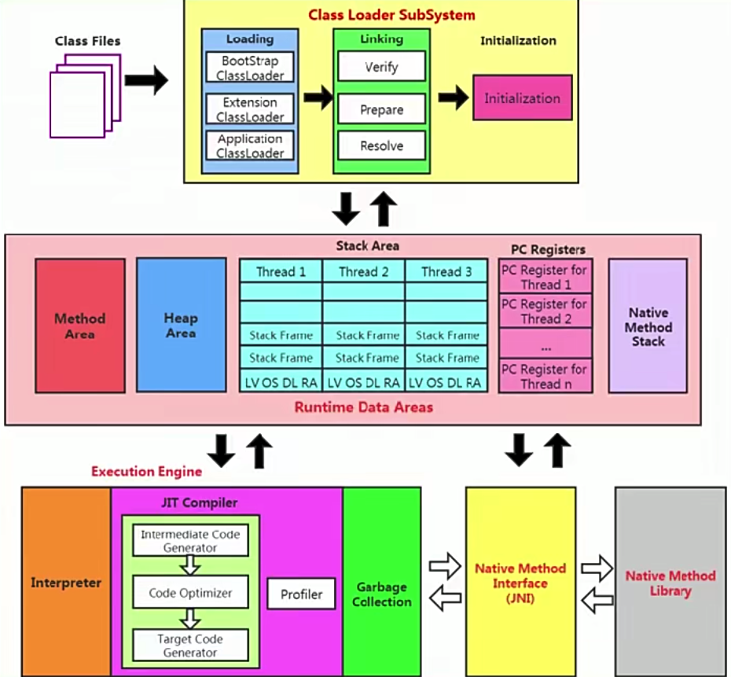


### 一、 字节码文件

1. 什么是字节码指令？
   1. 由一个字节长度的操作码以及跟随其后的0至多个代表此操作所需参数的操作数所构成
2. 多少分

```java
int[] a = new int[10];
int[] b = new int[100];
System.out.println(a.getClass() == b.getClass()); // true
```

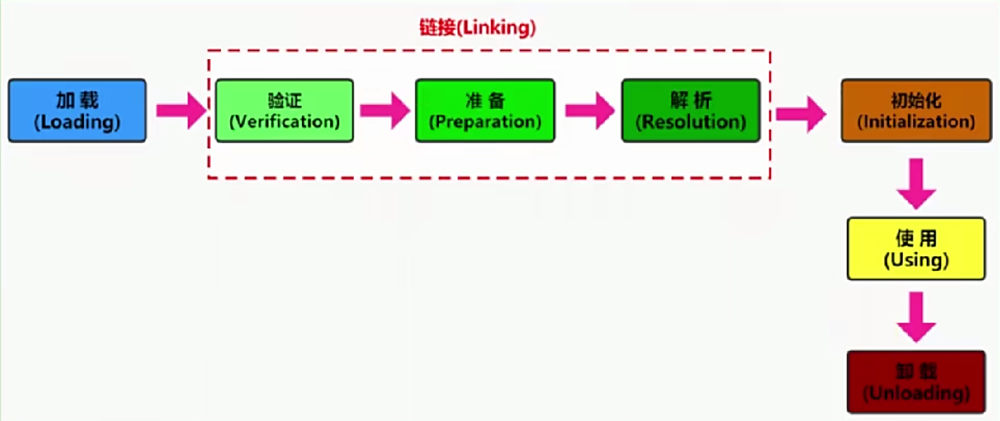

### 二、谁需要加载

1. 基本数据类型由虚拟机预先定义，引用数据类型则需要进行类的加载

### 三、类的加载过程

1. Loading（查找并加载类的二进制数据，生成Class的实例）：
   1. 就是将Java类的字节码文件加载到机器内存中，并在内存中构建出Java类的原型--类模版对象  
   2. 类模版的位置：加载的类在JVM中创建相应的类结构，类结构会存储在方法区（JDK1.8之前：永久代；JDK1.8之后：元空间）
   3. 类将.class文件加载至元空间后会在堆中创建一个java.lang.Class对象，用来封装类位于方法区内的数据结构，该Class对象是在加载类的过程中创建的，每个类都对应有一个Class类型的对象。外部可通过类的Class对象来获取该类的数据结构。Class类的构造方法是私有的，只有JVM能够创建。
2. Linking
   1. Verification：保证加载的字节码是合法、合理并符合规范的
   2. Preparation：为类的静态变量、分配内存，并将其初始化为默认值。final类型在编译的时候就会分配，准备阶段会显示赋值。实例变量会随着对象一起分配到堆中。
   3. Resolution：将类、接口、字段和方法的符号引用转为直接引用。resolution操作往往会伴随着JVM在执行完初始化之后再执行
3. Initialization
   1. 


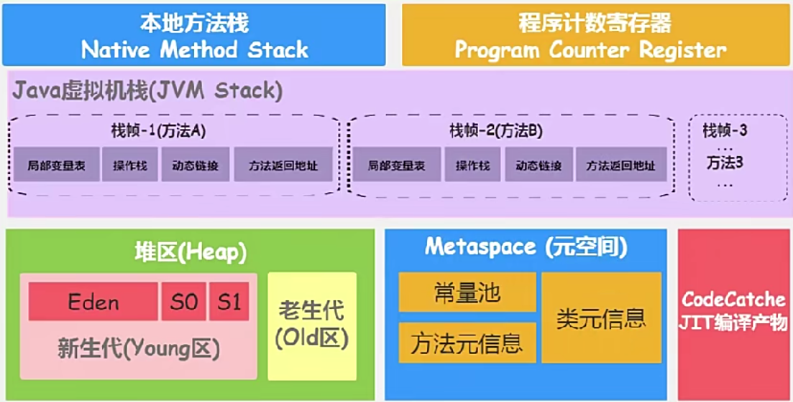

### 四、程序计数器

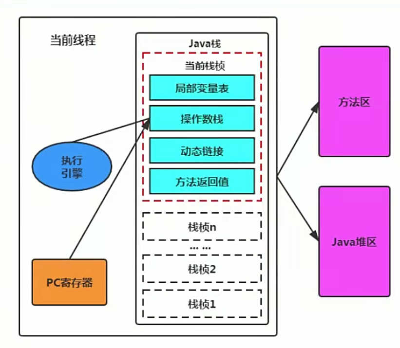

1. 是一块很小的内存空间，几乎可以忽略不计，也是运行速度最快的存储区域
2. 他是唯一一个在JVM规范中没有规定任何OOM情况的区域
3. 程序计数器是每个线程私有的
4. 存储需要执行的一行代码的字节码
5. CPU会从当前线程的程序计数器中获取当前线程所开始执行的行数

### 五、虚拟机栈

1. 概述
   1. 基本数据类型和引用地址存放在栈中
   2. 一个方法对应一个栈帧，一个线程对应一个栈
   3. 栈大小默认为512K~1M，取决于操作系统，一般为1M
   4. 栈中不存在GC，存在OOM
   5. 设置栈的大小：`-Xsssize（-XX:ThreadStackSize）`，如-Xss1024k
2. 栈帧
   1. 局部变量表
      1. 存储单位为slot，大小为1Byte
      2. 主要用于存储方法参数和定义在方法体内的局部变量；数据类型包括基本数据类型8种、对象引用、returnAddress类型
      3. 所需的容量是在编译期确定下来的
      4. 每个成员方法的局部变量表中，多出一个this对象，放在0号索引的位置
      5. long和double类型占用了2个slot
      6. 如果一个局部变量过了其作用域，在其作用域之后声明的新的局部变量就可能会复用过期的局部变量的slot
      7. 与GC Roots的关系：局部变量表中的变量也是重要的垃圾回收根节点，只要被局部变量表中直接或间接引用的对象都不会被回收
      8. 如果局部变量在内部产生并在内部消亡的，那就是线程安全的
   2. 操作数栈
      1. 主要用于保存计算过程的中间结果，同时作为计算过程中变量临时的存储空间
      2. 栈顶缓存技术（ToS： top-of-stack-caching）：由于操作数是存储在内存中，将栈顶元素全部缓存在物理CPU的寄存器中，以此降低对内存的读写次数，提升执行引擎的执行效率
   3. 动态链接
      1. 每个栈帧内部都包含一个指向那个运行时常量池中该栈帧所属方法的引用
      2. 在Java源文件被编译到字节码文件中时，所有的变量和方法引用都作为符号引用保存在class文件的常量池中，动态链接的作用就是为了将这些符号引用转换为调用方法的直接引用
      3. 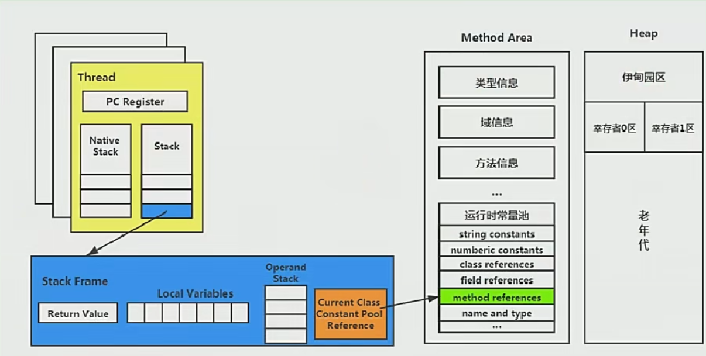
   4. 方法返回地址：指的是该栈帧结束后，该从哪开始继续执行

### 六、本地方法接口与本地方法栈

### 七、堆

1. 概述

   1. 堆可以处于物理上不连续的空间中，但在逻辑上它应该被视为连续的
   2. 在方法结束后，堆中的对象不会马上被移除，仅仅在GC的时候才会被移除
   2. 不同的对象生命周期不同，为了在GC时，不重复扫描那些生命周期很长的对象，减少STW的时间，最好把堆分代，主要目的是为了`优化GC性能`。但是不分代也是可以的
   4. 所有的线程共享Java堆，在这里还可以在Eden区划分线程私有的缓冲区（Thread Local Allocation Buffer，TLAB）。
      1. 通过设置`-XX:+/-UseTLAB`设置是否开启TLAB空间，默认开启。
      2. TLAB空间内存非常小，仅占整个Eden空间的1%，可以通过设置`-XX:TLABWasteTargetPercent`设置TLAB空间所占用Eden空间的百分比大小。
      3. 如果对象在TLAB空间分配内存失败，就会尝试通过使用加锁机制确保数据操作的原子性，从而直接在Eden空间中分配内存

2. 内部结构

   1. 现代垃圾收集器大部分都基于分代收集理论设计

      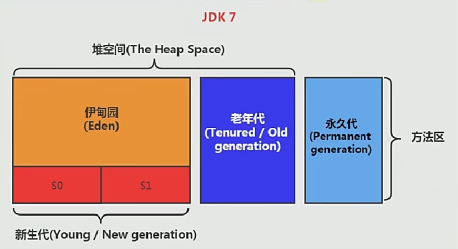

      

   2. 方法区逻辑上是堆空间的一部分，也叫做non-heap
   
   3. S0和S1分别也叫做from和to
   
   4. 新生代和老年代
   
      1. 存储在JVM中的Java对象分为两类
         1. 生命周期短的瞬时对象，这类对象的创建和消亡都非常迅速；这种对象放在YoungGen中
         2. 生命周期非常长，极端情况下和JVM的生命周期保持一致，一个JVM对应一个Runtime类；这种对象放在OldGen中
      2. 堆区进一步细分，可以分为YoungGen和OldGen
      3. 其中年轻代又可分为Eden区、Survivor0（from）和Survivor1（to）
      4. 
      4. 几乎所有的Java对象都是在Eden区被new出来的（大对象直接分配到OldGen）
      4. 绝大部分Java对象的销毁都在YoungGen进行
   
2. 内存分配原则

   1. 针对不同年龄段的对象分配原则如下所示
      1. 优先分配到Eden区
      2. 大对象直接分配到老年代
         1. 尽量避免程序中出现过多的大对象
      3. 长期存活的对象分配到老年代
      4. 动态对象年龄判断
         1. 如果Survivor区中相同年龄的所有对象大小总和大于Survivor空间的一半，年龄大于或等于该年龄的对象可以直接进入老年代，无须等到`-XX:MaxTenuringThreshold`中要求的年龄（to满了，全部进入老年代）
      5. 空间分配担保
         1. `-XX:HandlePromotionFailure`
   
4. 设置堆内存参数设置（一般堆内存设置为2GB）

   1. 堆的大小在JVM启动时就已经设定好了
      1. `-Xms（-XX:InitialHeapSize）`表示堆起始内存
      2. `-Xmx（-XX:MaxHeapSize）`表示堆最大内存
   2. 一旦超过-Xmx设定的值，就会OOM
   3. 通常会将-Xms和-Xmx配置相同的值，目的是为了能够在java垃圾回收机制清理完堆区后不需要重新分隔计算堆区的大小，从而提高性能。因为在GC完后，堆区会根据需要进行扩容或者缩容，最大小值设置成一样就不会出现这种情况
   4. 默认最小值：最少不少于8M，`if (物理内存 >= 1G) 最小值 = 物理内存 * (1 / 64)`
   5. 默认最大值：if(物理内存 < 192M) 最大值 = 物理内存 * (1 / 2)；`if(物理内存 >= 1G) 最大值 = 物理内存 * (1 / 4)`
   6. 设置新生代与老年代的比例
      1. 配置新生代与老年代在堆中的占比
         1. 默认`-XX:NewRatio=2` ，表示新生代占1，老年代占2
         2. 可以修改-XX:NewRatio=4，表示新生代占1，老年代占4
      2. 可以使用选项`-Xmn`设置新生代最大内存大小（一般使用默认值就可以了）
      2. 上面两个不同时使用
      3. 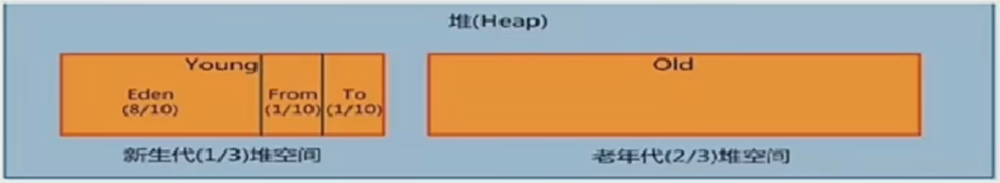
   7. 设置新生代中Eden和Survivor的比例
      1. 比例缺省值为：8:1:1
      2. 修改`-XX:SurvivorRatio=8` 表示Eden占8，Survivor0和Survivor1比例为1:1，共占2
   8. 空间分配担保策略
      1. 在发生Minor GC之前，JVM会检查老年代最大可用的连续空间是否大于新生代所有对象的总空间
         1. 如果大于，则此次Minor GC是安全的
         2. 如果小于，则虚拟机会查看-XX:HandlePromotionFailure设置值是否允许担保失败
         3. 如果HandlePromotionFailure=true，那么会继续检查老年代最大可用连续空间是否大于历次晋升到老年代的对象的平均大小，如果大于，则尝试进行一次Minor GC，但这次Minor GC依然是有风险的；如果小于或HandlePromotionFailure=false，则改为进行一次Full GC
      2. JDK6 Update 24之后的规则变为只要老年代的连续空间大于新生代对象总大小或者历次晋升的平均大小，就会进行Minor GC，否则将进行Full GC

5. Minor GC、Major GC和Full GC

   1. JVM进行GC时，大部分时候回收的都是指新生代
   2. GC按照回收区域分为两种
      1. 部分收集（Partial GC）：不是完整收集整个Java堆的垃圾收集
         1. 新生代收集（Minor GC）
         2. 老年代收集（Major GC）
            1. 目前只有CMS GC会有单独收集老年代的行为
            2. 很多时候Major GC会和Full GC混淆使用，需要具体分辨时老年代回收还是整堆回收
         3. 混合收集（Mixed GC）：整个新生代以及部分老年代的垃圾收集
            1. 目前只有G1 GC会有这种行为
      2. 整堆收集（Full GC）：整个Java堆和方法区的垃圾回收
   3. Minor GC触发机制
      1. 当Eden区满了后会触发Minor GC，Survivor满不会触发GC
      2. Minor GC非常频繁，一般回收速度也比较快
      3. Minor GC会引发STW，暂停其他用户的线程，等待垃圾回收结束，用户线程才恢复运行
   4. Major GC触发机制
      1. 出现了Major GC，经常会伴随至少一次的Minor GC（但非绝对的）
      2. 在老年代空间不足时，会先尝试触发Minor GC，如果之后空间还不足，则触发Major GC，并不是说Minor GC触发后，再触发Major GC。所以老年代GC说成“Major GC”或“Full GC”
      3. Major GC的速度一般会比Minor GC慢10倍以上，STW的时间更长
      4. 如果Major GC后，内存还不足，就报OOM
   5. Full GC触发机制
      1. 调用System.gc()或Runtime.getRuntime().gc()时，是系统建议执行Full GC，不是立刻执行
      2. 老年代空间不足
      3. 方法区空间不足
      4. 通过Minor GC后进入老年代的平均大小大于老年代的可用内存
      5. 由Eden区、from向to区复制时，对象的大小大于to的可用内存，则把该对象转存到老年代，且老年代的可用内存小于该对象大小

6. OOM如何解决

   1. 首先通过内存映像分析工具对dump出来的堆转储快照进行分析，重点是确认内存中的对象是否是必要的，也就是要分清楚到底是出现了内存泄漏（Memory Leak）还是内存溢出（Memory Overflow）
   2. 如果是内存泄漏，可进一步通过工具查看泄漏对象到GC Roots的引用链。于是就能找到泄漏对象是通过怎样的路径与GC Roots相关联并导致垃圾收集器无法自动回收他们的。掌握了泄漏对象的类型信息，以及GC Roots引用链的信息，就可以比较准确地定位出泄漏代码的位置
   3. 如果不存在内存泄漏，那就应当检查虚拟机堆参数，与机器物理内存对比看是否还可以调大，从代码上检查是否存在某些对象生命周期过长、持有状态时间过长的情况，尝试减少程序运行期的内存消耗

### 八、方法区

1. 

### 九、垃圾回收

1. 垃圾回收算法
   1. 垃圾判别阶段算法
      1. 引用计数算法
         1. 原理：每个对象保存一个整型的引用计数器属性，用于记录对象被引用的情况
         2. 优点：实现简单，垃圾对象便于辨识，判定效率高，回收没有延迟性
         3. 缺点：无法处理循环引用的情况。在Java垃圾回收器中没有使用这类算法
      2. 可达性分析算法
         1. 原理：以GC Roots为起始点，按照从上至下的方式搜索被根对象集合所连接的目标对象是否可达
         2. 优点：实现简单，执行高效，有效的解决循环引用的问题，防止内存泄漏
         3. GC Roots有哪些
            1. 虚拟机栈中引用的对象：如各个线程被调用的方法中使用到的参数、局部变量等
            2. 本地方法栈JNI（通常说的本地方法）引用的对象
            3. 类静态属性引用的对象：如Java类的引用类型静态变量
            4. 方法区中常量引用的对象：字符串常量池（String Table）里的引用
            5. 所有被同步锁synchronized持有的对象
            6. JVM内部的引用：基本数据类型对应的Class对象， 一些常驻的异常对象，系统类加载器
            7. 反映JVM内部情况的JMXBean、JVMTI中注册的回调、本地代码缓存等
         4. 如果要使用可达性分析算法来判断内存是否可回收，那么分析工作必须在一个能保障一致性的快照中进行。这点不满足的话分析结果的准确性就无法保证，这也是导致GC进行时必须STW的一个重要原因
   2. 垃圾清除阶段算法
      1. 标记-清除算法
         1. 当堆中的有效内存空间被耗尽的时候，就会STW，然后进行两项工作，第一项是标记，标记所有被引用的对象，一般是在对象的Header中记录为可达对象，第二项则是清除，但不是真正的置空
         2. 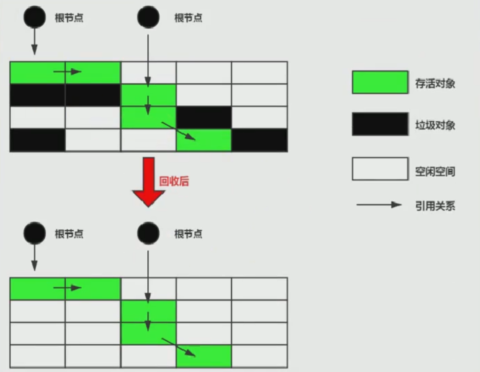
         3. 缺点
            1. 效率较低，标记和清除都需要遍历所有对象
            2. 在进行CG的时候，需要停止整个应用程序，导致用户体验差
            3. 这种方式清理出来的空闲内存是不连续的，产生内存碎片
         4. 应用场景：一般不怎么使用，在CMS中使用了
      2. 复制算法
         1. 将活着的内存空间分成两块，每次只使用其中一块，在垃圾回收的时，将正在使用的内存中的存活对象复制到未被使用的内存块中，之后清除正在使用的内存块中的所有对象，交换两个内存的角色，最后完成垃圾回收
         2. 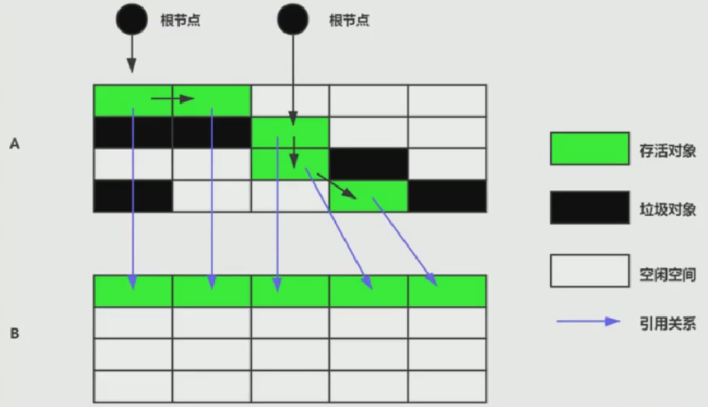
         3. 优点
            1. 没有标记和清除过程，实现简单，运行高效
            2. 复制过去以后保证空间的连续性，不会出现碎片问题
         4. 缺点
            1. 需要两倍的内存空间
            2. 对于G1这种分拆成大量region的GC，复制而不是移动，意味着GC需要维护的region之间对象的引用关系，不管是内存占用或者时间开销也不小
            3. 如果系统中的存活对象很多，复制算法不会很理想。因为复制算法需要复制的存活对象数量不会太大，或者说非常低才行。（当你有100个对象，存活了99个下来，会将99个给复制过去）
         5. 应用场景：新生代中80%的对象都是“朝生夕死”的，所以复制算法很适合回收新生代
      3. 标记-压缩算法
         1. 从根节点开始标记所有被引用的对象，再将所有的存活对象压缩到内存的一端，按顺序排放，之后，清理边界所有的空间。最终效果等同于标记清除法完成后，再进行一次内存碎片的整理
         2. 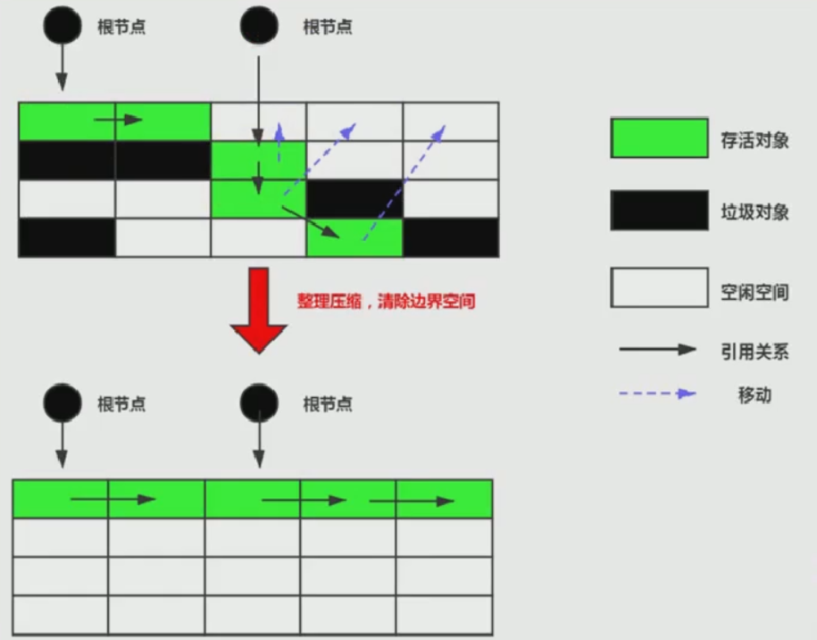
         2. 指针碰撞：如果内存空间以规整和有序的方式分布，即已用和未用的内存都各自一边，彼此之间维系着一个记录下一次分配起始点的标记指针，当为新对象分配内存时，只需要通过修改指针的偏移量将新对象分配在第一个空闲内存位置上，这种分配方式就叫做指针碰撞
         4. 优点
            1. 消除了标记清除法中，内存区域分散的缺点，我们需要给新对象分配内存时，JVM只需要持有一个内存的起始地址即可
            2. 消除了复制算法中，内存减半的高额代价
         5. 缺点
            1. 从效率上来说，标记压缩法要低于复制算法
               1. 效率不高，不仅要标记所有存活对象，还要整理所有存活对象的引用地址
               2. 对于老年代每次都有大量对象存活的区域来说，极为负重
            2. 移动对象的同时，如果对象被其他对象啊引用，则还需要调整引用的地址
            3. 移动过程中，需要全程暂停用户应用程序，即STW
      4. 分代收集算法
         1. 不同生命周期的对象可以采取不同的收集方式，以便提高回收效率
         1. 目前几乎所有的GC都是采用分代收集算法执行垃圾回收的
         1. 新生代区相对老年代较小，对象生命周期短、存活率低，回收频繁，并且复制算法内存利用率不高的问题，通过hotspot中的两个survivor的设计得到缓解
         4. 老年代区域较大，对象生命周期长、存活率高，复制算法不合适，一般是标记清除或者是标记清除与标记压缩混合实现
            1. Mark阶段的开销与存活对象的数量成正比
            2. Sweep阶段的开销与所管理区域的大小成正相关
            3. Compact阶段的开销与存活对象的数据成正比
         5. 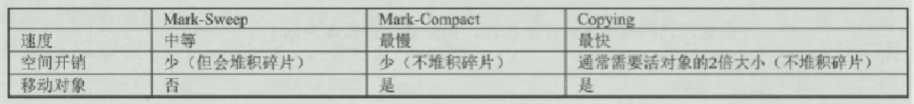
         6. 新生代用复制算法，老年代用标记压缩
      4. 增量收集算法
         1. 如果一次性将所有的垃圾进行处理，需要造成系统长时间的停顿，那么就可以让垃圾收集线程和应用程序线程交替执行。每次，垃圾收集线程只收集一小片区域的内存空间，接着切换到应用程序线程。依次反复，直到垃圾收集完成
         2. 增量收集算法的基础仍是传统的标记清除和复制算法。增量收集算法通过对线程间冲突的妥善处理，允许垃圾收集线程以分阶段的方式完成标记、清理或复制工作
         3. 缺点
            1. 使用这种方式，由于在垃圾回收过程中，间断性地还执行了应用程序代码，所以能减少系统的停顿时间。但是，因为线程切换和上下文转换的消耗，会使得垃圾回收的总体成本上升，造成系统吞吐量的下降
      4. 分区算法（针对G1）
         1. 分代算法将按照对象的生命周期长短划分成两个部分，分区算法将整个堆空间划分成连续的不同小区间
         2. 每一个小区间都独立使用，独立回收。这种算法的好处是可以控制一次回收多少个小区间
         3. 一般来说，在相同条件下，堆空间越大，一次GC时所需要的时间就越长，有关GC产生的停顿也越长。为了更好地控制GC产生的停顿时间，将一块大的内存区域分割成多个小块，根据目标的停顿时间，每次合理地回收若干个小空间，而不是整个堆空间，从而减少一次GC所产生的停顿
   
2. 垃圾回收器
   1. 分类
      1. 串行vs并行（按线程数分）
         1. 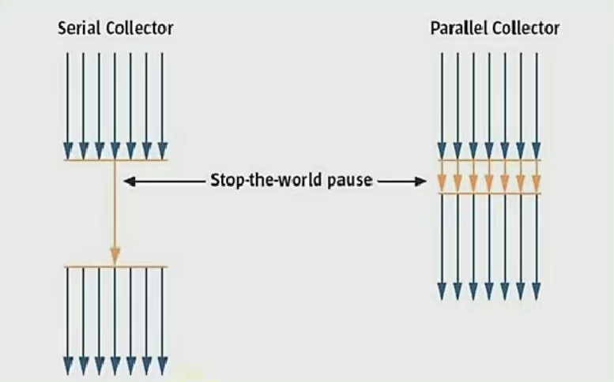
      2. 并发式vs独占式（按工作模式）
         1. 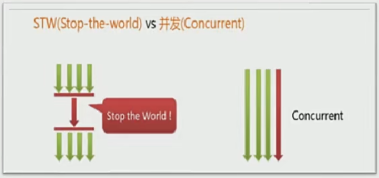
         1. 并发式，GC和应用程序线程交替工作，以尽可能减少应用程序的停顿时间
         1. 独占式，GC一旦运行，就停止用户程序中的所有用户线程
      3. 压缩式vs非压缩式（按碎片处理方式）
         1. 压缩式，GC会在回收完成后，对存活对象进行压缩整理，消除回收后的碎片
            1. 再分配对象空间使用：指针碰撞
         2. 非压缩式，GC不进行这步操作
            1. 再分配对象空间使用：空闲列表
      4. 年轻代vs老年代（按工作内存空间划分）
      
   1. GC评估指标
      
      1. 吞吐量：程序的运行时间 / CPU运行时间
         $$
         吞吐量=\frac{运行用户代码时间}{运行用户代码时间 + 运行垃圾收集时间}
         $$
      
      2. 暂停时间：执行垃圾收集时，程序的工作线程被暂停的时间
      
      3. 内存占用：Java堆区所占的内存大小
      
      4. 一款优秀的收集器，通常最多同时满足其中的两项
      
      5. 吞吐量越大越好，暂停时间越少越好。选择吞吐量优先，或者是低延迟优先
      
      5. 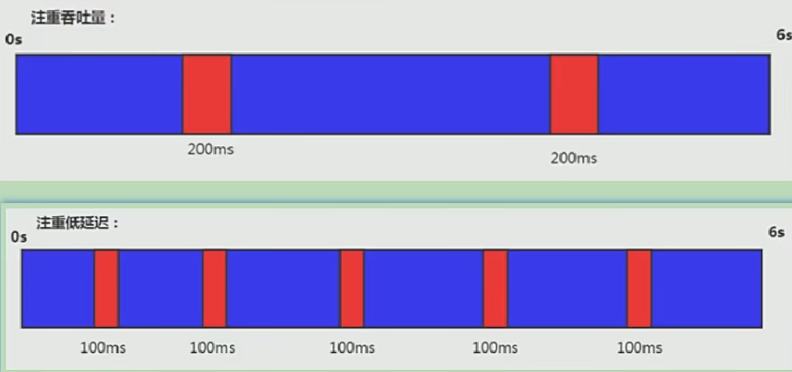
      
   3. 查看默认GC
   
      1. `-XX:+PrintCommandLineFlags`：查看命令行相关参数（包含使用的GC）
      2. 使用命令行指令`jinfo -flag (UseParallelGC -> 相关垃圾回收器参数) 进程ID` 
   
   4. 7种经典GC组合关系
   
      1. 
      2. CMS GC作为并发GC，当其挂掉后，由Serial Old GC顶替上去
      2. 红色虚线：JDK8将这两种搭配声明为废弃，并在JDK9中完全取消了这些组合的支持
      2. 绿色虚线：JDK14弃用了这一对组合
      2. 青色虚线：JDK14中删除CMS垃圾回收器
   
   5. Serial GC：串行回收
   
      1. Serial收集器采用复制算法、串行回收和STW机制的方式执行内存回收
      2. Serial Old收集器采用标记压缩算法、串行回收和STW机制执行内存回收
      3. Serial和Serial Old是运行在Client模式下默认的新生代和老年代的垃圾回收器
      4. 
      4. 与其他收集器的单线程情况下比简单而高效。适用于单核CPU的情景下，但对于强交互式的引用而言，不适合，在Java Web应用中，是不会采用串行垃圾收集器的
      4. 使用`-XX:UseSerialGC`指定年轻代和老年代都使用串行收集器
   
   6. ParNew GC：并行回收
   
      1. 可以说是Serial收集器的多线程版本，只能处理新生代，是很多JVM运行在Server模式下新生代的默认垃圾收集器
      2. ParNew和Serial除了ParNew采用并行回收外，两者之间几乎没有任何区别
      3. ParNew收集器采用复制算法、并行回收和STW机制执行回收
      4. 
      4. 对于新生代，回收次数频繁，使用并行方式高效；对于老年代，回收次数少，使用串行方式节省资源（可以省去切换线程的资源）；若指定新生代使用ParNewGC，老年代默认使用SerialOldGC；若指定老年代使用CMSGC，新生代默认使用ParNewGC
      4. ParNewGC在多CPU的环境下，可以充分利用资源，更快速地完成垃圾收集，提升程序的吞吐量；在单CPU的环境下，效率没有Serial收集器高
      4. 使用`-XX:UseParNewGC`指定年轻代使用并行收集器；使用`-XX:ParallelGCThreads`限制线程数量，默认开启和CPU数相同的线程数
   
   7. Parallel GC：吞吐量优先
   
      1. Parallel Scavenge收集器采用复制算法、并行回收和STW机制
      2. Parallel Old收集器采用标记压缩算法、并行会后和STW机制
      3. 和ParNew收集器不同，Parallel Scavenge收集器目标是达到一个可控制的吞吐量；自适应调节策略（默认SurvivorRatio为8，自适应时会改变比例大小，比如说6）也是与ParNew的一个重要区别
      4. 
      4. `-XX:+UseParallelGC`和`-XX:+UseParallelOldGC`相互激活
      4. `-XX:ParallelGCThreads`设置年轻代并行收集器的线程数，最好与CPU数相等，若CPU数量小于8，其值就等于CPU数，若CPU数量大于8，其值等于3 + [5 * CPU_Cout] / 8
      4. `-XX:MaxGCPauseMillis`设置STW的时间，尽可能把停顿时间控制在参数范围以内，该参数需要谨慎设置
      4. `-XX:GCTimeRatio`垃圾收集时间占总时间的比例（1 / （N  + 1）），取值范围（0，100）默认是99，也就是垃圾回收时间不超过1%，与前一个参数有矛盾性。暂停时间越长，Radio参数就容易超过设定的比例
      4. `-XX:+UseAdaptiveSizePolicy`设置Parallel Scavenge收集器具有自适应调节策略，在这种模式下，年轻代的大小、Eden和Survivor的比例、晋升老年代的对象年龄等参数会被自动调整，以达到在堆大小、吞吐量和停顿时间之间的平衡点。在手动调优比较困难的情况下，可以直接使用这种自适应的方式
      
   8. CMS：低延迟
   
      1. 刚发的
   
   9. G1 GC：区域化分代式
   
      1. G1是一个并行回收器，它把堆内存分割为很多不相关的区域（Region）（物理上不连续的）。使用不同的Region来表示Eden、Survivor0、Survivor1，老年代等；有计划地避免在整个Java堆中进行全区域的垃圾收集。G1跟踪各个Region里面的垃圾堆积的价值大小（回收所获得的空间大小以及回收所需时间的经验值），在后台维护一个优先列表，每次根据允许的收集时间，优先回收价值最大的Region；是JDK9的默认垃圾回收器
      2. 是兼顾并发和并行的，也有分代收集的特性
      3. Region之间是复制算法，但整体上实际可看作是标记压缩算法。当Java堆非常大的时候，G1的优势更加明显
      4. 可预测的停顿时间模型
         1. 这是G1箱啊对于CMS的另一个大优势，G1除了追求低停顿外，还能建立可预测的停顿时间模型，能让使用者明确指定在一个长度为M毫秒的时间片段上，消耗在垃圾收集上的时间不得超过N毫秒
      5. 参数设置
         1. `-XX:+UseG1GC`手动指定使用G1收集器执行内存回收任务
         2. `-XX:G1HeapRegionSize`设置每个Region的大小。值是2的幂，范围是1MB到32MB之间，目标是根据最小的Java堆大小划分出约2048个区域。默认是堆内存的1 / 2000
         3. `-XX:MaxGCPauseMillis`设置期望达到的最大GC停顿时间指标（JVM会尽力实现，但不保证达到）。默认值是200ms
         4. `-XX:ParallelGCThreads`设置STW时GC线程数的值。最多设置为8
         5. `-XX:ConcGCThreads`设置并发标记的线程数。将n设置为并行垃圾回收线程数（ParallelGCThreads）的1 / 4左右
         6. `-XX:InitiatingHeapOccupancyPercent`设置触发并发GC周期的Java堆占用率阈值。超过此值，就触发GC，默认值为45
      6. 操作步骤
         1. 开启G1垃圾收集器
         2. 设置堆的最大内存
         3. 设置最大的停顿时间
      7. G1提供了三种垃圾回收模式：YoungGC、Mixed GC和Full GC，在不同的条件下被触发
   
3. 内存泄漏和内存溢出
   1. 内存溢出
      1. 垃圾回收已经跟不上内存消耗的速度
      2. 堆内存设置不够
      3.  代码中创建了大量大对象，并且长时间不能被垃圾收集器收集
      4. 一般来说OOM前必有GC，但也不是在任何情况下，GC都会被触发，如我们去分配一个超大的对象，超过了堆的最大值，JVM判断出垃圾收集并不能解决这个问题，直接抛出OOM
   2. 内存泄漏（8种情况）
      1. 静态集合类
         1. 如HashMap、LinkedList等，如果这些容器为静态的，那么它们的生命周期与JVM程序一致，容器中的对象在程序结束之前将不能被释放。简而言之，长生命周期对象持有短生命周期对象的引用，尽管短生命周期对象不再使用，但是因为长生命周期对象持有它的引用而导致不能被回收
      2. 单例模式
         1. 单例模式和静态集合导致内存泄漏的原因类似，因为单例的静态特性，如果单例对象持有外部对象的引用，那么这个外部对象也不会被回收，那么就会造成内存泄漏
      3. 内部类持有外部类
         1. 如果一个外部类的实例对象返回了一个内部类的实例对象，并且这个内部类对象被长期引用，即使那个外部类实例对象不再被使用，但由于内部类持有外部类的实例对象，这个外部类对象将不会被垃圾回收
      4. 各种连接，如数据库连接、网络连接和IO连接等
         1. 当不再使用连接时，需要调用close方法来释放连接，只有连接被关闭后，垃圾回收器才会收回对应的对象。如果不显示地关闭，将会造成大量的对象无法被回收，从而引起内存泄漏
      5. 变量不合理的作用域
         1. 一个变量的定义的作用范围大于其使用范围，很有可能会造成内存泄漏，另一方面，如果没有及时地把对象设置为null，很有可能导致内存泄漏的发生
      6. 改变哈希值
         1. 当一个对象被存储进HashSet中后，就不能修改这个对象中的那些参与计算哈希值的字段了，否则将无法从HashSet中单独删除当前对象，造成内存泄漏
      7. 缓存泄漏
         1. 一旦把对象引用放入缓存中，就很容易遗忘。可以使用WeakHashMap代表缓存，此种Map的特点是，当除了自身有对key的引用外，此key没有其他引用，那么此map会自动丢弃此值。若是频繁使用的缓存，可以改为软引用
      8. 监听器和回调
         1. 如果客户端在你实现的API中注册回调，却没有显示的取消，那么就会积聚。需要确保回调立即被当作垃圾回收的最佳方法是，只保存它的弱引用，例如将他们保存成为WeakHashMap中的键
   
4. 5种引用
   1. 强引用：不回收
   2. 软引用：内存不足即回收（SoftReference实现），高速缓存就有用到软引用
   3. 弱引用：发现即回收（WeakReference实现），非常适合来保存那些可有可无的缓存数据
   4. 虚引用：对象回收跟踪（PhantomReference实现）
   5. 终结器引用