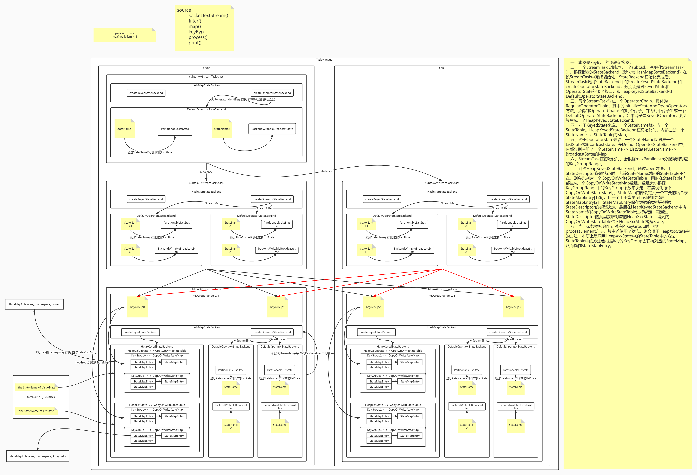

1. JobManager主要有两个功能：作业调度和检查点协调。
2. TaskManager：是作业实际执行的地方，通过Slot对其资源进行逻辑分割。

## 一、运行/部署

1. Session Mode
   1. 优点：资源充分共享， 提升资源利用率；Job在Flink Session集群中管理，运维简单。
   2. 缺点：资源隔离相对较差；非Native类型部署，TM不易拓展，Slot计算资源伸缩性较差。
   3. 开启Session： `${FLINK_HOME}/bin/yarn-session.sh -jm 1024m -tm 4096m`。
   4. 提交任务到Session：`bin/flink run -t yarn-session -Dyarn.application.id=application_id /path/jar`、` bin/flink run -yid appliation_id /path/jar`或`bin/flink run /path/jar -> 读取/tmp/.yarn-properties-root文件`。
   5. attach到Session：`bin/yarn-session.sh -id application_id`。
   6. 停止Session：`echo "stop" | bin/yarn-session.sh -id application_id`。
2. Per-job Mode（Deprecated in Flink1.15）
   1. 优点：Job与Job之间资源隔离充分；资源根据Job需要进行申请，TM Slots数量可以不同。
   2. 缺点：资源相对比较浪费，JM需要消耗资源；Job的管理完全交给ClusterManagement，管理复杂。
   3. 提交任务到Yarn：`bin/flink run -t yarn-per-job -Dtaskmanager.numberOfTaskSlots=2 --detached /path/jar`或者`bin/flink run -m yarn-cluster -yjm 1024m -ytm 4096m -p 4 /path/jar`。
3. Application Mode（Flink 1.11）
   1. 原理：客户端无需将Dependencies上传到JM，JM和TM会从HDFS上获取jar包；JobGraph在JM中生成，客户端压力降低。
   2. 优点：有效降低带宽和客户端负载；Application实现资源隔离，Application中实现资源共享。
   3. 缺点：功能太新，还未经过生产验证，仅支持Yarn和Kubunetes。
   4. 提交任务：`bin/flink run-application -t yarn-application -Djobmanager.memory.process.size=2048mb -Dtaskmanager.memory.process.size=4096mb -Dyarn.provided.lib.dirs="hdfs://bigdata01:9000/libs/flink/lib;hdfs://bigdata01:9000/libs/flink/plugins" -c main_class jars`。

## 二、基本概念

1. 程序中的算子本质上是调用DataStream中的transform方法，生成各种Transformation，然后把该Transformation保存到StreamExecutionEnvironment内部的List中。
2. keyBy解析：
   1. 该方法并不会生成一个算子，也就是说keyBy并没有生成运算拓扑的节点；但是keyBy依然生成了Transformation，也就是说它规定了上下两个节点数据的分区方式。

## Flink调优

1. 资源调优
   1. 
2. checkpoint调优
3. 大状态
4. Job优化

flink并不能实现真正意义上的end-to-end的Exactly_Once，也不能做到EOS中每条数据只被处理一次，而是实现了flink内部state的精确一致（故障重启后，每个算子的状态都恢复到最新的被统一数据影响后的状态的值）
，end-to-end的EOS是通过Source、算子状态、Sink端的配置，来尽可能实现（其中的数据可能被处理了多次，但是最终还是一致的）

Source端：能够记录偏移量在状态、能够重放数据（数据并不是发送过就没了）

flink内部算子状态：checkpoint -> 基于chandy-lamport分布式快照算法，往数据流中插入barrier（Watermark类似），barrier也是一种StreamRecord
算子接收到barrier后，会在本地进行异步快照

    进行checkpoint的时候，必须保证算子的状态被同一数据影响后，才能保存
    对齐的checkpoint：
                当算子有两个输入通道时，接收两个barrier-n，只有当两个barrier-n到齐后，才进行快照，先到达的barrier-n对应的那条输入通道的数据会被缓存下来，
            在第二个barrier-n到达，开启异步快照后，缓存起来的数据就会被先处理。会产生背压，对数据处理效率有影响
    非对齐的checkpoint只能保证at least once
    checkpoint调用流程实质是2PC
    ack中包括了一些元数据，包含刚才备份到StateBackend的状态句柄，也就是指向状态的指针，对于source，则是包含读取到的偏移量
    做checkpoint时，JM的CheckpointCoordinator会向Source的每个subtask发送checkpoint-n（id），source接收到ck请求后，通过广播的方式，
            将barrier-n发送到下游，同时本地做一次快照到StateBackend，并返回ack给CheckpointCoordinator，下游也是通过广播的方式发送barrier-n。
            当sink算子接收到barrier-n后，有两种情况：
                （1）flink内部state的EOS，sink对自己的state进行快照，然后给CheckpointCoordinator发送ack，当CheckpointCoordinator
            接收到每个节点的ack后，会给每个节点notify，告知该次checkpoint已完成
                （2）end-to-end flink EOS，在sink往外输出之前，则会在外部数据库先开启事务，然后将收到的数据输出到外部系统，当barrier-n到达时，
            sink对自己的state进行快照，然后给CheckpointCoordinator发送ack，再预提交事务（pre-commit），并不是开启事务，
            而是把该次事务信息（事务ID、事务状态标志-pending）保存在外部系统或sink状态中，向CheckpointCoordinator发送ack，同时开启下一次事务，
            接着CheckpointCoordinator接收到每个算子的ack后，会notify每个算子确认本次的checkpoint完成，sink会将该事务进行提交（commit），
            提交完成后，会将事务状态标志改成已完成或删除。
            若中途发送故障，则下次任务失败重试时，sink会先检查状态中是否包含了pending状态的事务，若存在，则会先将该pending状态的事务进行提交（commit）。

Sink端：幂等写入、2PC事务提交、2PC预写日志提交、HDFS文件

    （1）HDFS:（重命名） flink正常写in-gress文件，当发起chckpoint的时候in-gress文件改成pending，
            当checkpoint完成时pending改成finish. 如果checkpoint成功后还没来得及改就挂掉文件依然是pending, 
            当flink任务从checkpoint起来后会得到状态，将pending文件改成finsh，将in-gress文件给清理掉(2.7版本以后支持) 
            这样就保证了一致性
    （2）幂等写入: 目标存储系统支持幂等写入，且数据中有合适的主键（MySQL、HBase、Redis）
            能实现最终一致，但有可能存在过程中的不一致（能保证最终的key只有一个，但是当key对应的值不确定时（随机），可能出现过程不一致）
            如往MySQL表(id primary key, name, age)插入一条数据1, zs, 18, 此时任务失败，重新插入的数据为1, ls, 20，则会导致之前的数据被覆盖掉
            缺点：某种定义上的脏读、以及过程不一致
            
            虽然Kafka Producer到Broker内部支持幂等性，但是作为Flink的Sink，则不支持幂等写入。
                    Kafka Producer往Broker中发送数据时，若Producer没有收到Broker的ack，则会一直发该条数据，
                但是Broker会将收到的数据与缓存中的数据的producerid和sequence num进行比较，认为只有一条数据，则只会写入一条数据，
                这是Kafka内部的幂等性。
                    作为Flink Sink时，当任务失败重试时，同一条数据，会被Producer认为是不同的数据，且分配不同的序列号，Broker则会认为
                该数据是一条新数据，也会将其写入，此时就造成了该数据的重复写入，故在Flink EOS Sink中，Kafka是不支持幂等写入的
    （3）2PC事务提交（Kafka伪事务）
            Kafka中，发送数据时，开启事务会给数据加上一个标记消息（control message），任务失败重试时，事务中的数据被写入到kafka，
                但是该条数据没有事务结束的标记，在后续的Kafka消费者中，通过设置事务的隔离级别ReadCommited，将读取到的没有事务结束标记的消息给过滤掉，
                从而实现了end-to-end Flink EOS
    
    （4）2PC预写日志提交，极端情况下，可能会导致at least once
            当外部系统不支持事务或者幂等性。将数据全部写到Sink的算子状态中，该状态做快照，然后发送ack，等CheckpointCoordinator的notify来了，
                再把存在自己state中的结果数据发送到外部存储系统

Flink SQL客户端集成Hive
create catalog hive_catalog with ('type' = 'hive', 'hive-conf-dir' = '/opt/hive-3.1.2/conf');
use catalog hive_catalog;
load module hive;

