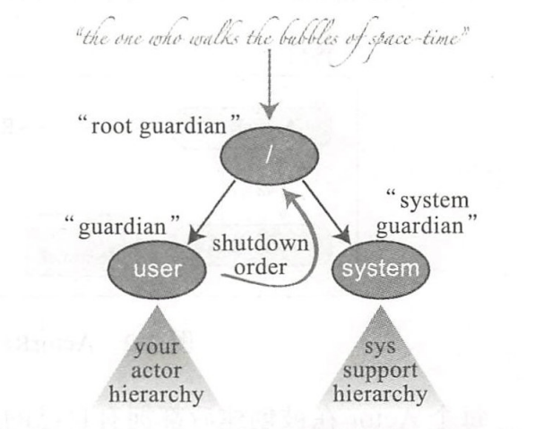
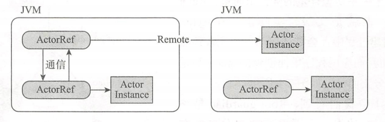

### 一、ActorSystem层级结构

1. 在ActorSystem创建的过程中，会默认启动三个比较顶级的Actor，我们应用程序里面创建的Actor只是其中的一个分支而已。一般来说每个应用程序只需要一个ActorSystem对象即可。
2. 左边的`/user`分支是我们最常见到的，所有通过ActorSystem.actorOf()方法创建的Actor都属于该分支下，其他通过ActorContext.actorOf()方法创建的Actor都是其子集。
3. 右边的`/system`分支下的Actor都是系统层面创建的，开发阶段并不需要对其过多关注。

### 二、引用路径

1. Actor既可能存在于本地，也可能存在于远程，使用ActorRef来表示对一个Actor的引用，可理解为代理对象，外界不能随意修改其内部状态。
2. 每个Actor在被创建后都拥有自己的路基，遵循ActorSystem的层级结构：
   1. 本地：` akka://sys/user/parentActor/childActor`。
   2. 远程：`akka.tcp://sys@host:port/user/parentActor/childActor`。

