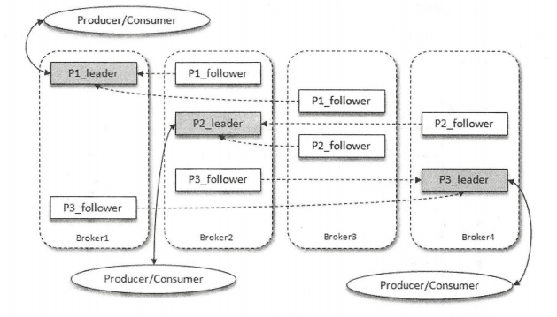
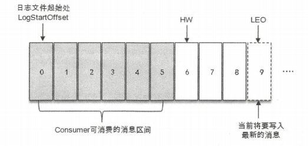

### 一、基础概念

1. topic是逻辑概念，partition是物理概念，分区在存储层面可以看作一个可追加的日志文件（*.log）
2. 一个分区由一个leader副本、0或多个follower副本分布在broker上

   1. 生产者/消费者只与leader副本进行交互，而follower副本只负责消息的同步
   2. leader副本负责维护和追踪ISR集合中所有follower副本的滞后状态（从ISR移除或从OSR添加到ISR）。默认情况下，只有在ISR集合中的副本才有资格被选举为新的leader
3. 分区中的所有副本统称AR（assigned Replicas），其中AR = ISR + OSR
   1. ISR: in sync replicas同步副本（包括leader），ISR集合是AR集合中的一个子集
   2. OSR：out of sync replicas同步超时的副本，同步超时时间：`replica.lag.time.max.ms=10000`

4. HW：High Watermark标识了一个特定的消息偏移量（offset），消费者只能poll到这个offset之前的消息（不包括）

5. LEO：Log End Offset标识当前日志文件中下一条待写入消息的offset，等于当前日志分区中最后一条消息的offset + 1

   

6. 分区ISR集合中的每个副本都会维护自身的LEO，而ISR集合中最小的LEO即为分区的HW，对消费者而言只能消费HW之前的消息。上图的HW为4，LEO为5。

副本手动分配，在创建topic时，不可与--partitions连用
--replica-assignment broker_id_for_part1_replica1:broker_id_for_part1_replica2,
                     broker_id_for_part2_replica1:broker_id_for_part2_replica2, ...

删除topic，server.properties中需要一个参数处于启用状态： delete.topic.enable=true
使用kafka-topics.sh脚本删除主题的行为本质上只是在ZooKeeper中的/admin/delete_topics路径下建一个与待删除主题同名的节点，
以标记该topic为待删除的状态。
然后由Kafka控制器异步完成删除。