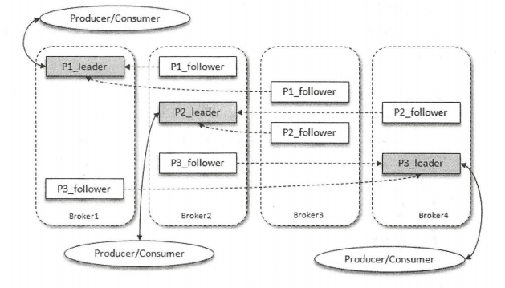
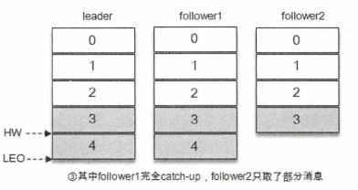
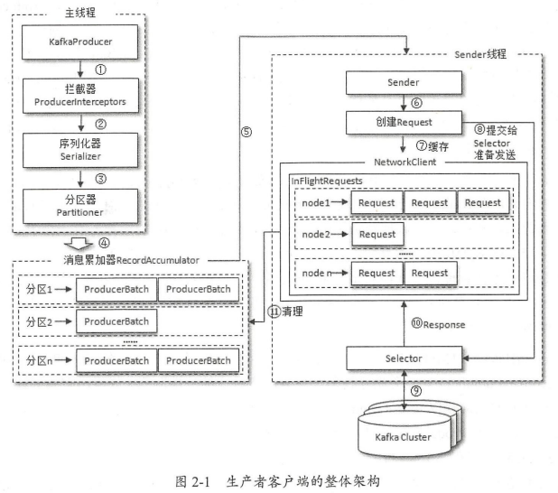
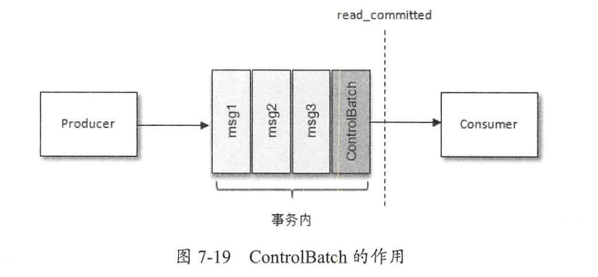

### 一、基础概念



1. topic是逻辑概念，partition是物理概念，分区在存储层面可以看作一个可追加的日志文件（*.log）。
2. 一个分区由一个leader副本、0或多个follower副本分布在broker上：

   - 生产者/消费者只与leader副本进行交互，而follower副本只负责消息的同步。
   - leader副本负责维护和追踪ISR集合中所有follower副本的滞后状态（从ISR移除或从OSR添加到ISR）。默认情况下，只有在ISR集合中的副本才有资格被选举为新的leader。
3. 分区中的所有副本统称AR（assigned Replicas），其中AR = ISR + OSR：
   - ISR: in sync replicas同步副本（包括leader），ISR集合是AR集合中的一个子集

   - OSR：out of sync replicas同步超时的副本，同步超时时间：`replica.lag.time.max.ms=10000`。

      

   - HW：High Watermark标识了一个特定的消息偏移量（offset），消费者只能poll到这个offset之前的消息（不包括）。

   - LEO：Log End Offset标识当前日志文件中下一条待写入消息的offset，等于当前日志分区中最后一条消息的offset + 1。

      

   - 分区ISR集合中的每个副本都会维护自身的LEO，而ISR集合中最小的LEO即为分区的HW，对消费者而言只能消费HW之前的消息。上图的HW为4，LEO为5。

### 二、生产者Producer（线程安全）

1. 基本代码见code：com.lancer.bigdata.kafka.code.producer.E01_KafkaProducer。

2. ProducerRecord --> 封装消息的类

   ```java
   public class ProducerRecord<K, V> {
       private final String topic;
       // 分区
       private final Integer partition;
       // 消息头部，kafka0.11.x才引入
       private final Headers headers;
       private final K key;
       private final V value;
       // 消息的时间戳，有createtime和LogAppendTime（消息追加到日志文件的时间）两种类型
       private fianl Long timestamp;
   }
   ```

3. 正常的生产逻辑

   1. 配置生产者客户端参数及创建相应的生产者实例 --> `producer.properties` 。
   2. 构建待发送的消息。
   3. 发送消息及关闭生产者实例。

4. 

   - 由两个线程协调运行，分别为main线程和Sender线程。
   - RecordAccumulator：
     - 在main线程中创建消息，经过可能的①、②、③操作后，将消息缓存到RecordAccumulator中。Sender线程负责从RecordAccumulator中获取消息并将其发送到Kafka中。
     - RecordAccumulator：主要用来缓存消息，以便Sender线程可以批量发送，进而减少网络I/O的请求次数以提升性能和整体吞吐量。其大小通过`buffer.memory`配置，默认为33554432B。
     - RecordAccumulator的内部为每个分区都维护了一个`Deque<ProducerBatch>`，双向队列的尾部追加消息，头部读取消息。
   - 当一条消息流入RecordAccumulator时：
     1. 会先寻找与消息分区所对应的Deque(如果没有则新建一个)。
     2. 再从这个Deque的尾部获取一个ProducerBatch(如果没有则新建一个)。
     3. 新建ProducerBatch时，若该消息的大小超过`batch.size`，则按照该消息的大小创建ProducerBatch，且这段内存区域不会复用，否则按照`batch.size`的大小创建ProducerBatch，默认为16384B。
     4. 若该消息超过了获取到的ProducerBatch的剩余大小，则新建一个ProducerBatch。
   - 发送消息之前需要通过ByteBuffer创建一块内存区域保存对应的消息。在RecordAccumulator的内部有一个BufferPool，主要用来实现ByteBuffer的复用，减少ByteBuffer的频繁创建和释放。BufferPool只缓存`batch.size`大小的ByteBuffer，而其他大小的ByteBuffer不会缓存进BufferPool中。
   - 
   - 生产者发送消息的速度超过发送到服务器的速度，则会导致生产者内存不足，send()方法调用要么阻塞，要么抛异常，取决于参数`max.block.ms`的配置，默认为6000ms。

副本手动分配，在创建topic时，不可与--partitions连用
--replica-assignment broker_id_for_part1_replica1:broker_id_for_part1_replica2,
                     broker_id_for_part2_replica1:broker_id_for_part2_replica2, ...

### 三、消费者（非线程安全）

1. 基本代码见code：com.lancer.bigdata.kafka.code.E02_KafkaConsumer。
2. 正常的消费逻辑步骤：
   1. 配置消费者客户端参数及创建相应的消费者实例 --> `consumer.properties`。
   2. 订阅主题。
   3. 拉取消息并消费。
   4. 提交消费offset
   5. 关闭消费者实例。
3. 


### 主题和分区


### 日志存储


###  四、客户端

1. ***分区分配策略***：在消费者和消费者组模型中的对于**单个**消费者组而言。`partition.assignment.strategy`，可以配置多个分配策略。

   - org.apache.kafka.clients.consumer.RangeAssignor（默认）
     - 按照消费者总数和分区总数进行整除运算来获得一个跨度，然后将分区按照跨度进行**平均分配**，以保证分区尽可能均匀地分配给所有的消费者。
     - 对于每一个topic，RangeAssignor会将消费者组内所有订阅这个主题的消费者按照名称的字典序排序。然后为每个消费者划分固定的分区范围，如果不够平均分配，那么字典序靠前的消费者会被多分配一个分区。
     - 缺点：假设消费者组内有2个消费者，都订阅了主题t0和t1，并且每个主题都有3个分区，最终的分配结果：
       - 消费者0：t0-p0、t0-p1、t1-p0、t1-p1
       - 消费者1：t0-p2、t1-p2
   - org.apache.kafka.clients.consumer.RoundRobinAssignor --> 待完善
     - 将消费者组内所有消费者及消费者订阅的所有主题的分区按照字典序排序，然后通过轮询方式逐个将分区依次分配给每个消费者。
     - 如果同一个消费者组内所有消费者的订阅信息都是相同的，那么分区将会是均匀的。
     - 
   - org.apache.kafka.clients.consumer.StickyAssignor --> 待完善
     - 发送到
   - 自定义分区分配策略，实现org.apache.kafka.clients.consumer.internals.PartitionAssignor接口 --> 待完善
     - 的撒

2. ***消息传输保障***：一般而言，消息中间件的消息传输（producer/consumer）保障有3个层级，分别如下：

   - **at most once：至多一次**

     - producer向kafka发送消息时，一旦消息被成功提交到日志文件，由于多副本机制的存在，这条消息就不会丢失。
     - 当producer发送消息到kafka后，遇到了网络问题造成通信中断，producer可以进行多次重试来确保消息已经写入了kafka，这个重试的过程有可能造成消息的重复写入。

   - **at least once：最少一次**

     - 对consumer而言，consumer处理消息和提交offset的顺序在很大程度上决定了消费者提供哪一中消息。

   - **exactly once：精确一次**

     - kafka通过幂等和事务这两个特性，以此来实现EOS（exactly once semantics）：

       - **幂等**：对接口的多次调用所产生的结果和调用一次是一致的。

         1. 解决producer进行重试的时候有可能会重复写入消息。
         2. 在producer端配置`enable.idempotence = true`，同时还要确保producer客户端的`retries`、`acks`、`max.in.flight.requests.per.connection`这几个参数不被配置错。
            - 实际上在使用幂等性功能时，不建议配置这几个参数。
            - retries默认被置为Inter.MAX_VALUE，acks默认被置为-1且只能为-1，max.in.flight.requests.per.connection默认被置为5且不能超过5。
         3. *为实现生产者的幂等性，kafka为此引入了`producer id`和`sequence number`，分别对应提到的v2版的日志格式中的`RecordBatch`的`producer id`和`first seqence`这两个字段。*
            1. 每个producer实例在初始化的时候都会被分配一个producer id，这个producer id对用户是透明的。
            2. 对于每个producer id，消息发送到的每一个分区都有对应的sequence number，这些序列号从0开始单调递增。
            3. producer每发送一条消息就会将内存中的<producer id，分区>对应的sequence number的值加1。
         4. *broker端也会在内存中为每一对<producer id，分区>维护一个sequence number。*
            1. 对于收到的每一条消息，只有当它的序列号的值（SN_new）比broker端中维护的对应的序列号的值 （SN_old）大1（即SN_new - 1 = SN_old）时，broker才会接受它。
            2. 当SN_new - 1< SN_old，那么说明消息被重复写入，broker可以直接将其丢弃。
            3. 当SN_new - 1 > SN_old，那么说明中间有数据尚未写入，出现了乱序，可能有消息丢失，对应的producer会抛出OutOfOrderSequenceException。
         5. *引入sequence number来实现幂等也只是针对每一对<producer id，分区>而言的，即kafka的幂等只能保证单个生产者会话中的单分区的幂等。*
         6. 当发送两条内容相同的消息时，对于kafka而言是两条不同的消息，因为这两条消息会被分配不同的sequence number，故kafka并不会保证消息内容的幂等。

       - **事务**：可以保证对多个分区写入操作的原子性。

         1. 弥补幂等性不能跨多个分区运作的缺陷。

         2. 通过客户端参数`transactional.id`来提供唯一的事务id，同时要求producer开启幂等性（开启事务后，`enable.idempotence`默认为true）。

         3. transactional id与producer id一一对应。为了保证新的producer启动后，具有相同的transactional id的旧producer能够立即失效，每个生产者通过transactional id获取producer id的同时，还会获取一个单调递增的producer epoch（对应的initTransactions方法）

            - producer epoch对应v2版的日志格式中的`RecordBatch`的`producer epoch`字段。

         4. 在消费端有一个参数`isolation.level`，默认值为“read_uncommitted”，表示消费端可以消费到未提交的事务。还可以设置为“read_committed ”，表示消费端不可以看到尚未提交的事务内的消息，但是KafkaConsumer内部会缓存这些消息，直到producer提交事务后，它才能将这些消息推送给消费端应用。

            

         5. 日志文件中除了普通的消息，还有一种消息专门用来标志一个事务的结束，它就是控制消息（ControlBatch）。控制消息一共有两种类型：COMMIT和ABORT，分别用来表征事务已经成功提交或被成功终止。

            - 消费者可以通过这个控制消息来判断对应的事务是被提交了还是被中止了，然后结合参数isolation.level配置的隔离级别来决定是否将相应的消息返回给消费端。ControlBatch对消费端不可见。

         6. consume-transform-produce应用模式 --> 重难点！

### 五、服务端


删除topic，server.properties中需要一个参数处于启用状态： delete.topic.enable=true
使用kafka-topics.sh脚本删除主题的行为本质上只是在ZooKeeper中的/admin/delete_topics路径下建一个与待删除主题同名的节点，
以标记该topic为待删除的状态。
然后由Kafka控制器异步完成删除。