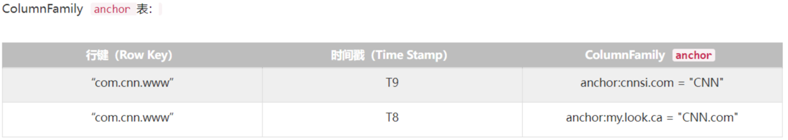

## 一、数据视图

### 逻辑模型

1. table（表）：一张表包含多行数据。
2. row（行）：
   - 一行数据包含一个唯一标识rowkey、多个column以及对应的值。
   - 一张表中所有的row都按照rowkey的字典序由小到大排序。
3. column（列）：
   - 由column family（列簇）以及qualifier（列名）两部分组成。
   - 列簇在表创建的时候需要指定，用户不能随意增减。
   - 一个列簇下可以设置多个qualifier。
   - HBase会把相同列簇的列尽量放在同一台机器上。
   - 表的很多属性，比如过期时间、数据块缓存以及是否压缩等都是定义在列簇上。
   - 列簇越少越好，太多会极大程度地降低数据库性能。
4. cell（单元格）：
   - 由五元组（row，column，timestamp，type，value）组成的结构。
   - 其中type标识Put/Delete这样的操作类型。
   - timestamp表示这个cell的版本。
   - （row，column，timestamp，type）是K，value是V。
5. timestamp（时间戳）：
   - 每个cell在写入HBase的时候都会默认分配一个时间戳作为该cell的版本。
   - 用户在写入数据的时候可以自带时间戳。
   - 同一rowkey或column下可以有多个value存在，这些value使用timestamp作为版本号，版本越大，数据越新。

### 多维稀疏排序Map

1. 多维：key是一个复合数据结构，由多维元素组成。
2. 稀疏：对于HBase，空值不需要任何填充。如果使用填充null的策略，势必会造成大量空间的浪费。
3. 排序：如果rowkey相同，再比较column，依次往下比较。多维元素排序规则对于提升HBase的读性能至关重要。
4. 分布式：构成HBase的所有Map并不集中在某台机器上，而是分布在整个集群中。

### 物理视图

1. HBase中的数据是按照列簇存储的，即将数据按照列簇分别存储在不同的目录中。

2. 列簇anchor的所有数据存储在一起形成：

   

3. 列簇contents的所有数据存储在一起形成：

   

## 二、体系结构

1. Client：

   - Shell命令窗口、原生JavaAPI接Thrift/REST API编程接口以及MapReduce编程接口。
   - HBase客户端访问数据行之前，首先需要通过ZK中的元数据表（hbase:meta）定位目标数据所在RegionServer，之后才会发送请求到该RegionServer。同时这些元数据会被缓存在客户端本地，以方便之后的请求访问。如果集群RegionServer发生宕机或执行了rebalance等，从而导致数据分片发生迁移，客户端需要重新请求最新的元数据并缓存在本地。

2. ZooKeeper：

   - 实现Master高可用。
   - 管理系统核心元数据：
     - 管理当前系统中正常工作的RegionServer集合。
     - 保存系统元数据表hbase:meta所在的RegionServer地址。
   - 参与RegionServer宕机恢复：
     - ZK通过心跳感知到RegionServer是否宕机，并在RegionServer宕机后通知Master进行宕机恢复。
   - 实现分布式表锁：
     - HBase中对一张表进行各种管理操作（比如alter）需要先加表锁，防止其他用户对同一张表进行管理操作，造成表状态不一致。
     - 和其他RDBMS表不同，HBase中的表通常都是分布式存储，ZK可以通过特定机制实现分布式表锁。

3. Master：

   - 处理用户的各种管理请求：
     - 建表、修改表、权限操作、切分表、合并数据分片以及Compaction等。
   - 管理集群中所有RegionServer：
     - 报错RegionServer中Region的负载均衡、RegionServer的宕机恢复以及Region的迁移等。
   - 清理过期日志以及文件：
     - Master会每隔一段时间检查HDFS中HLog是否过期、HFile是否已经被删除，并在过期之后将其删除。

4. RegionServer（主要用来响应用户的IO请求，是HBase中最核心的模块）：

   - WAL（HLog/Write Ahead Log）：

     - 用于实现数据的高可靠性：
       - HBase数据随机写入时，并非直接写入HFile数据文件，而是先写入缓存，再异步刷新落盘。为了防止缓存数据丢失，数据写入缓存之前需要首先顺序写入HLog，这样即使缓存数据丢失，仍然可以通过HLog日志恢复。
     - 用于实现HBase集群间主从复制：
       - 通过回放主集群推送过来的HLog日志实现主从复制。

   - BlockCache：

     - HBase系统中的读缓存：
       - 客户端从磁盘读取数据之后，通常会将数据缓存到系统内存中，后续访问同一行数据可以直接从内存中获取而不需要访问磁盘，对于带有大量热点读的业务来说，缓存机制会带来极大的性能提升。
       - 缓存对象是一系列的Block块，一个Block默认为64KB，由物理上相邻的多个KV数据组成。
     - 同时利用了空间局部性和时间局部性原理：
       - 前者表示最近将读取的KV数据很可能与当前读取到的KV数据在地质上是最邻近的，缓存单位是Block，而不是单个KV就可以实现空间局部性。
       - 后者表示一个KV数据正在被访问，那么近期它还可能再次被访问。
     - 主要有两种实现LRUBlockCache和BucketCache：
       - 前者实现相对简单，而后者在GC优化方面有明显的提升。

   - Region

     - 数据表的一个分片，当数据表大小超过一定阈值就会水平切分，分裂为两个Region。

     - Region是集群负载均衡的基本单位。通常一张表的Region会分布在整个集群的多台RegionServer上，一个RegionServer上通常会管理多个Region，这些Region一般来自不同的数据表。

     - 一个Region由一个或多个Store构成，Store的个数等于列簇的个数。每个列簇的数据都集中存放在一起形成一个存储单元Store，因此建议将具有相同IO特性的数据设置在一个列簇中：

       - 每个Store由一个MemStore和一个或多个HFile（HFile <--> StoreFile）组成。

       - MemStore成为写缓存，用户写入数据时，首先会写到MemStore，当MemStore写满后（默认128MB），系统会异步地将数据flush成一个HFile文件。

         当HFile文件超过一定阈值之后，系统将会执行Compact操作，将这些小文件通过一定策略合并成一个或多个大文件。

5. HDFS：

   - HBase底层依赖HDFS组件存储实际数据，包括用户数据文件、HLog日志文件等，最终都会写入HDFS落盘。
   - HBase内部封装了一个名为DFSClient的HDFS客户端组件，负责对HDFS的实际数据进行读写访问。