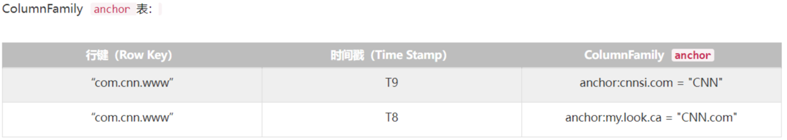
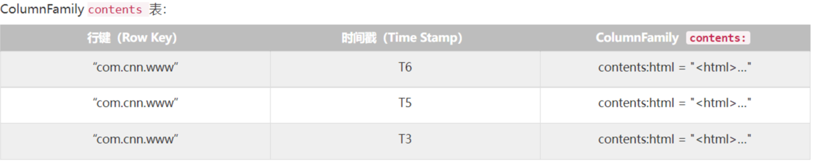
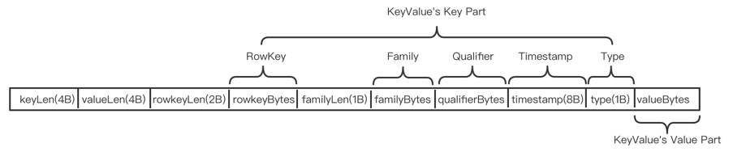
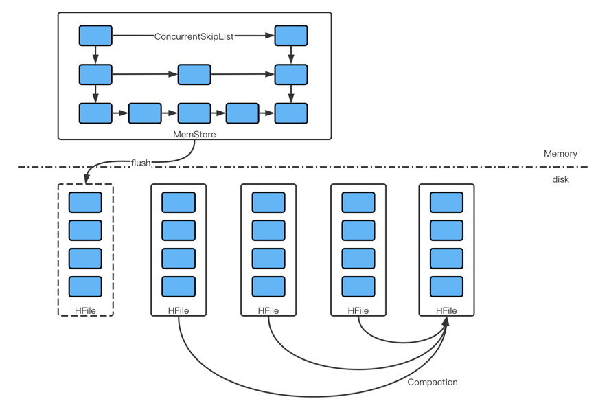

## 一、数据视图

### 逻辑模型

1. table（表）：一张表包含多行数据。
2. row（行）：
   - 一行数据包含一个唯一标识rowkey、多个column以及对应的值。
   - 一张表中所有的row都按照rowkey的字典序由小到大排序。
3. column（列）：
   - 由column family（列簇）以及qualifier（列名）两部分组成。
   - 列簇在表创建的时候需要指定，用户不能随意增减。
   - 一个列簇下可以设置多个qualifier。
   - HBase会把相同列簇的列尽量放在同一台机器上。
   - 表的很多属性，比如过期时间、数据块缓存以及是否压缩等都是定义在列簇上。
   - 列簇越少越好，太多会极大程度地降低数据库性能。
4. cell（单元格）：
   - 由五元组（row，column，timestamp，type，value）组成的结构。
   - 其中type标识Put/Delete/DeleteColumn/DeleteFamily这样的操作类型。
   - timestamp表示这个cell的版本。
   - （row，column，timestamp，type）是K，value是V。
5. timestamp（时间戳）：
   - 每个cell在写入HBase的时候都会默认分配一个时间戳作为该cell的版本。
   - 用户在写入数据的时候可以自带时间戳。
   - 同一rowkey或column下可以有多个value存在，这些value使用timestamp作为版本号，版本越大，数据越新。

### 多维稀疏排序Map

1. 多维：key是一个复合数据结构，由多维元素组成。
2. 稀疏：对于HBase，空值不需要任何填充。如果使用填充null的策略，势必会造成大量空间的浪费。
3. 排序：如果rowkey相同，再比较column，依次往下比较。多维元素排序规则对于提升HBase的读性能至关重要。
4. 分布式：构成HBase的所有Map并不集中在某台机器上，而是分布在整个集群中。

### 物理视图

1. HBase中的数据是按照列簇存储的，即将数据按照列簇分别存储在不同的目录中。

2. 列簇anchor的所有数据存储在一起形成：

   

3. 列簇contents的所有数据存储在一起形成：

   

## 二、体系结构

1. Client：

   - Shell命令窗口、原生JavaAPI接Thrift/REST API编程接口以及MapReduce编程接口。
   - HBase客户端访问数据行之前，首先需要通过ZK中的元数据表（hbase:meta）定位目标数据所在RegionServer，之后才会发送请求到该RegionServer。同时这些元数据会被缓存在客户端本地，以方便之后的请求访问。如果集群RegionServer发生宕机或执行了rebalance等，从而导致数据分片发生迁移，客户端需要重新请求最新的元数据并缓存在本地。

2. ZooKeeper：

   - 实现Master高可用。
   - 管理系统核心元数据：
     - 管理当前系统中正常工作的RegionServer集合。
     - 保存系统元数据表hbase:meta所在的RegionServer地址。
   - 参与RegionServer宕机恢复：
     - ZK通过心跳感知到RegionServer是否宕机，并在RegionServer宕机后通知Master进行宕机处理。
   - 实现分布式表锁：
     - HBase中对一张表进行各种管理操作（比如alter）需要先加表锁，防止其他用户对同一张表进行管理操作，造成表状态不一致。
     - 和其他RDBMS表不同，HBase中的表通常都是分布式存储，ZK可以通过特定机制实现分布式表锁。

3. Master：

   - 处理用户的各种管理请求：
     - 建表、修改表、权限操作、切分表、合并数据分片以及Compaction等。
   - 管理集群中所有RegionServer：
     - RegionServer中Region的负载均衡（创建表时生成一个Region，持续向表中插入数据，达到一定阈值后，Region会分裂，分裂到一定程度后，部分Region会迁移到其他RegionServer）。
     - RegionServer的宕机恢复以及Region的迁移等。
   - 清理过期日志以及文件：
     - Master会每隔一段时间检查HDFS中HLog是否过期、HFile是否已经被删除，并在过期之后将其删除。

4. RegionServer（主要用来响应用户的IO请求，是HBase中最核心的模块）：

   - WAL（HLog/Write Ahead Log）：

     - 用于实现数据的高可靠性：
       - HBase数据随机写入时，并非直接写入HFile数据文件，而是先写入缓存，再异步刷新落盘。为了防止缓存数据丢失，数据写入缓存之前需要首先顺序写入HLog，这样即使缓存数据丢失，仍然可以通过HLog日志恢复。
     - 用于实现HBase集群间主从复制：
       - 通过回放主集群推送过来的HLog日志实现主从复制。

   - BlockCache：

     - HBase系统中的读缓存：
       - 客户端从磁盘读取数据之后，通常会将数据缓存到系统内存中，后续访问同一行数据可以直接从内存中获取而不需要访问磁盘，对于带有大量热点读的业务来说，缓存机制会带来极大的性能提升。
       - 缓存对象是一系列的Block块，一个Block默认为64KB，由物理上相邻的多个KV数据组成。
     - 同时利用了空间局部性和时间局部性原理：
       - 前者表示最近将读取的KV数据很可能与当前读取到的KV数据在地质上是最邻近的，缓存单位是Block，而不是单个KV就可以实现空间局部性。
       - 后者表示一个KV数据正在被访问，那么近期它还可能再次被访问。
     - 主要有两种实现LRUBlockCache和BucketCache：
       - 前者实现相对简单，而后者在GC优化方面有明显的提升。

   - Region

     - 数据表的一个分片，当数据表大小超过一定阈值就会水平切分，分裂为两个Region。

     - Region是集群负载均衡的基本单位。通常一张表的Region会分布在整个集群的多台RegionServer上，一个RegionServer上通常会管理多个Region，这些Region一般来自不同的数据表。

     - 一个Region由一个或多个Store构成，Store的个数等于列簇的个数。每个列簇的数据都集中存放在一起形成一个存储单元Store，因此建议将具有相同IO特性的数据设置在一个列簇中：

       - 每个Store由一个MemStore和一个或多个HFile（HFile <--> StoreFile）组成。
    - MemStore成为写缓存，用户写入数据时，首先会写到MemStore，当MemStore写满后（默认128MB），系统会异步地将数据flush成一个HFile文件。
       - 当HFile文件超过一定阈值之后，系统将会执行Compact操作，将这些小文件通过一定策略合并成一个或多个大文件。

5. HDFS：

   - HBase底层依赖HDFS组件存储实际数据，包括用户数据文件、HLog日志文件等，最终都会写入HDFS落盘。
   - HBase内部封装了一个名为DFSClient的HDFS客户端组件，负责对HDFS的实际数据进行读写访问。

## 三、HBase建表时的设计原则

1. 预分区：
   - HBase默认建表时有一个Region，这个Region是没有startkey和endkey的，会产生两个问题：
     1. 数据往一个Region写，会有写热点问题。
     2. Region的切分会消耗宝贵的集群IO资源。
   - 需要在建表的时候，创建多个空Region，并确定每个Region的startkey和endkey，只要rowkey设计能均匀命中各个Region，就不会存在写热点问题。
2. rowkey设计原则（三大原则）：
   - 唯一性原则：
     - rowkey是按照字典顺序排序存储的，设计rowkey时要充分利用排序的特点，将经常读取的数据存储到一块，将最近可能会被访问的数据放到一块。
   - 长度原则：
     - rowkey最大长度为64KB，以字节数组保存，建议越短越好，不要超过16个字节。
     - HFile是按照KeyValue存储的，如果rowkey过长，那么会极大影响HFile的存储效率。MemStore中不能缓存更多的数据，这样会降低检索效率。采用8字节整数倍利用了操作系统的最佳特性。
   - 散列原则：
     - 加盐：在rowkey的前面增加随机数，使数据分散到不同的Region中。
3. 列簇设计原则：
   - 建表时至少指定一个列簇，但一般不超过三个。因为flush和compaction是以Region为单位，当某个列簇触发flush时，同Region内的其他Store也会触发flush，从而导致大量的IO。
   - 列簇名字不宜过长，会冗余存储。
   - 同Region中的不同列簇记录的数量级不易相差太大，比如表中有A，B两个列簇，A为100万条，B为1000亿条，则B记录增多导致的Region分裂，会使A被分散到多个Region中，导致对A的扫描效率低下。

### 四、核心数据结构和算法

```
1. HBase的列簇本质上就是一棵LSM树。
2. LSM树分为内存部分和磁盘部分。内存是一个维护有序数据集合的数据结构，可选平衡二叉树、红黑树、SkipList等，考虑并发性能，采用SkipList。磁盘部分由一个个独立的文件组成，每一个文件又是由一个个数据块组成。磁盘寻道以及数据读取都是非常耗时的操作（IO耗时），为了避免不必要的IO耗时，在磁盘中存储一些额外的二进制数据，即布隆过滤器。
```

1. **LSM树：**

   本质上和B+树一样，是一种磁盘数据的索引结构。和B+树不同的是，LSM树的索引对写入请求更友好。因为无论是何种写入请求，LSM都会将写入操作处理为一次顺序写，而HDFS擅长的正是顺序写。

   **LSM树中存放的并非数据本身，而是操作记录。**

   - KeyValue存储格式：

     

     - 比较KeyValue的大小顺序时，按照以下来确定大小关系：

       ```java
       int compare(KeyValue a, KeyValue b) {
           int ret = Bytes.compare(a.rowKeyBytes, b.rowKeyBytes);
         	if (ret != 0) return ret;
         	ret = Bytes.compare(a.familyBytes, b.familyBytes);
           if (ret != 0) return ret;
           ret = Bytes.compare(a.qualifierBytes, b.qualifierBytes);
         	if (ret != 0) return ret;
           // timestamp越大，排序越靠前
         	ret = b.timestamp - a.timestamp;
         	if (ret != 0) return ret;
         	ret = a.type - b.type;
           return ret;
       }
       ```

   - LSM树的索引结构：

     

     - LSM树索引一般有两部分组成，一部分是内存部分，一部分是磁盘部分。内存部分一般采用SkipList来维护一个有序的KeyValue集合。磁盘部分一般由多个内部KeyValue有序的数据文件组成。
     - 内存部分导出形成一个有序数据文件的过程称为flush：
       - 为了避免影响性能，会先把当前写入的MemStore设为Snapshot，另开一个内存空间作为MemStore，然后面的数据写入。一旦Snapshot的MemStore写入完毕，对应的内存空间就可以释放。**通过两个MemStore来实现稳定的写入性能。**
       - 在整个数据写入过程中，LSM树全部都是使用append操作（磁盘顺序写）来实现数据写入的，没有使用任何seek + write（磁盘随机写）的方式来写入。无论HDD还是SSD，磁盘的顺序写操作性能和延迟都远好于磁盘随机写。
     - 随着写入的增加，内存数据会不断地刷新到磁盘上，一旦用户有读取请求，则需要将大量的磁盘文件进行多路归并（`com.shadow.garden.basic.sort.E00_KMergeSort`），之后才能读取所需的数据，因为需要将那些Key相同的数据全局综合起来，最终选择出合适的版本返回给用户。
     - 为了优化读取操作的性能，采取一定的策略将选中的多个HFile进行多路归并，合并成一个文件。一般来说，按照选中的文件个数，我们将compaction操作分成两种类型：
       1. major compact：是将所有的HFile一次性多路归并成一个文件。这种方式的好处是，合并之后只有一个文件，这样读取的性能肯定是最高的，但是合并所有的文件可能需要很长的时间并消耗大量的IO带宽，所以major compact不宜使用太频繁，适合周期性地跑。
       2. minor compact：选中少数几个HFile，将他们多路归并成一个文件，进行局部的compaction，通过少量的IO减少文件个数，适合较高频率地跑，但是只合并了局部数据，对于那些全局Delete操作，无法在合并的过程中完全删除。
     - HBase中设计了异步的compaction来降低文件个数，达到提高读取性能的目的。
   
1. **BloomFilter：**

   - 在[论文](http://www.eecs.harvard.edu/~michaelm/NEWWORK/postscripts/BloomFilterSurvey.pdf)中证明，当`N = K * |A| / ln2`时（其中K表示hash函数个数，|A|表示集合A元素个数），能保证最佳的误判率。
- 在HBase1.x版本中，用于可以对某些列设置不同类型的布隆过滤器：
      - NONE：关闭布隆过滤器。
   - ROW：按照rowkey来计算布隆过滤器的二进制串并存储。
      - ROWCOL：按照rowkey + family + quailfier这3个字段拼出byte[]来计算布隆过滤器值并存储。
- HBase的Get操作就是通过运用低成本高效率的布隆过滤器来过滤大量无效数据块的。
   - 一般意义上的Scan操作，HBase都没法使用布隆过滤器来提升扫描数据性能。对于ROWCOL类型的布隆过滤器来说，如果在Scan操作中明确指定需要扫描某些列，则在扫描同一rowkey时，可以通过该类型的布隆过滤器优化。
- 在HBase2.x版本上，已经实现了通过rowkey中固定长度的前缀计算布隆过滤器，前缀布隆过滤器对Get和基于前缀扫描的Scan都非常友好。